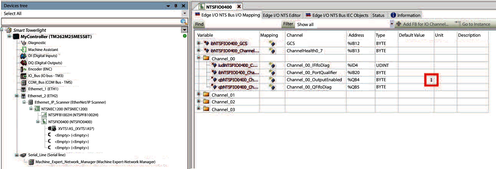
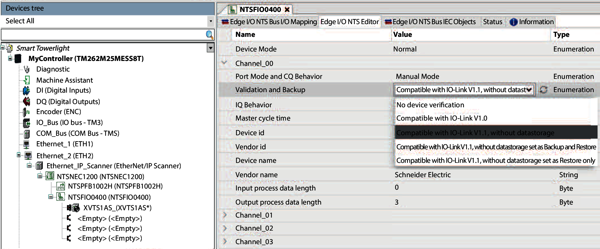
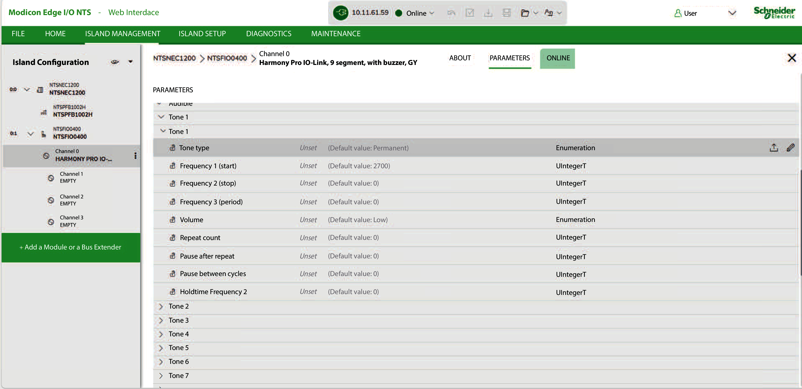

# Set IO-Link Master Parameters

## NTSFIO0400 Field Device Master

**Channels Overview**

The Edge I/O NTS Bus I/O Mapping tab consists of the following channels: 00, 01, 02, and 03. Only channels 0 and 1 can be used.

Each channel consists of parameters of the IODD file that allows you to configure the I/O mapping of the controller.

**Establish IO-Link Communication**

The Edge I/O NTS Editor tab provides system and IO-Link access rights to parameters.

In the Edge I/O NTS Bus I/O Mapping tab of the NTSFIO0400 field device master, the OutputEnabled parameter for the relevant channel have to be set to **1** before you can write to the light tower:

In the Edge I/O NTS Editor tab of the NTSFIO0400 field device master, select Compatible with IO-Link V1.1, without datastorage to establish a communication with the IO-Link devices:

Validation and Backup parameter defines the behavior of the IO-Link Master:

* **No device verification**: IO-Link Master sends the data from the connected IO-Link devices to the controller without performing any checks.
* **Compatible with IO-Link V1.0**: IO-Link Master can communicate with IO-Link devices supporting only version 1.0 of the IO-Link communication protocol.
* **Compatible with IO-Link V1.1, without datastorage**: IO-Link Master does not save its parameters and those of the devices associated with it.
* **Compatible with IO-Link V1.1, datastorage set as Backup and Restore**: IO-Link Master automatically saves its parameters and those of the devices associated with it each time a modification is done.
* **Compatible with IO-Link V1.1, datastorage set as Restore only**: IO-Link Master does not automatically save its parameters and those of the devices associated with it each time a modification is done (backups are performed manually).

The datastorage function is used to duplicate the configuration of an old IO-Link Master to a new one, keeping its configuration and those of the IO-Link devices associated with it.

## Modicon Edge I/O NTS – Web Interface

The NTSFIO0400 field device master can also be configured using the Modicon Edge I/O NTS – Web Interface:

Refer to the [Modicon Edge I/O Configurator and Web Interface User Guide](https://product-help.se.com/displayHelpBook?product=EDGE_IO&version=latest&virtualBookName=EdgeIO_Conf_UG) to know how to use it.

EIO0000005746.00