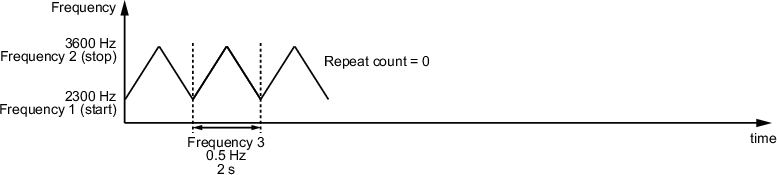
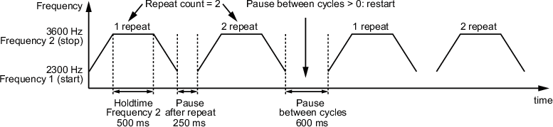

# Audible

## Overview

Ten preset tones are available to define the siren behavior.

The process data output range is between **1 to 10**. Each of these values refers to a tone presented in [Predefined Tones](#Audible-B98155A1__PredefinedTones-CB20AD83).

Process data table:

| Byte | 0 | | | | | | | |
| --- | --- | --- | --- | --- | --- | --- | --- | --- |
| Bit | — | — | — | — | 3 | 2 | 1 | 0 |

## Predefined Tones

| Tone | Type | Frequency (start, stop, period) | Max.dB |
| --- | --- | --- | --- |
| 1 | Permanent | 2700, 0, 0 | 104 |
| 2 | Permanent | 900, 0, 0 | 96 |
| 3 | Pulse | 2100, 0, 4200 | 97 |
| 4 | Pulse | 900, 0, 200 | 93 |
| 5 | Pulse | 2646, 0, 200 | 103 |
| 6 | Pulse | 900, 0, 10 | 96 |
| 7 | Pulse | 2700, 0, 10 | 104 |
| 8 | Sweep | 2300, 3600, 5 | 104 |
| 9 | Permanent | 2646, 0, 0 | 105 |
| 10 | Alternating | 1200, 800, 10 | 95 |

## Custom Tones

To configure a tone, select a tone type and use the following parameters:

| Parameter | Value | Description |
| --- | --- | --- |
| Tone type | 0 | Sound off |
| 1 | Permanent |
| 2 | Pulse |
| 3 | Rising |
| 4 | Falling |
| 5 | Alternating |
| 6 | Sweep |
| Frequency 1 (start) | 245…6000 | Frequency at the start of a cycle in Hz |
| Frequency 2 (stop) | 0 (Tone type 1)  245…6000 (Tone type 2…6) | Frequency at the end of a cycle in Hz |
| Frequency 3 (period) | 0 (Tone type 1)  1…10000 (Tone type 2…6) | Frequency for time between frequency 1 and frequency 2 in Hz\*10 |
| Volume | 0 | Low |
| 1 | Medium |
| 2 | Loud |
| 3 | Very loud |
| Repeat count | 0…65535 | Repeat count |
| Pause after repeat | 0…65535 | Pause after repeat |
| Pause between cycles | 0…65535 | Duration of the pause between cycle in ms |
| Hold time frequency 2 | 0…65535 | Setting of the hold time for frequency 2 in ms |

The following diagram shows the respective effects of the parameters:

EIO0000005746.00