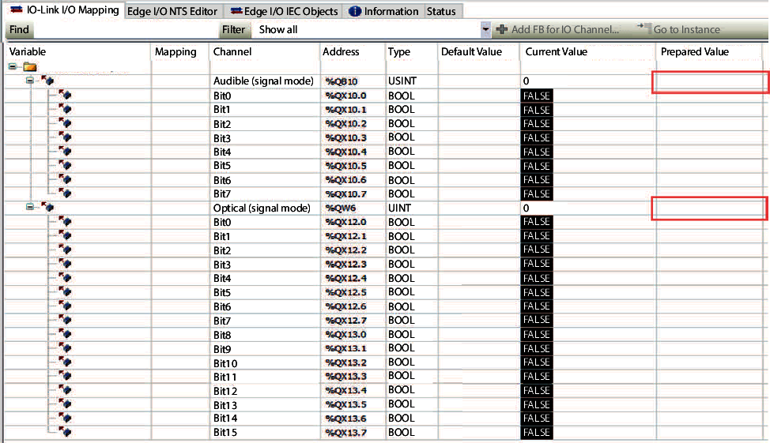

# EcoStruxureTM Machine Expert

With EcoStruxureTM Machine Expert, you have to write your process data into the corresponding addresses of the I/O mapping.

You can also directly enter yours process data values in the Prepared Value column:

EIO0000005746.00