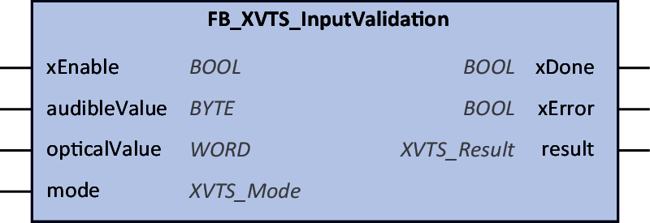

# Function Block

## Functional Description

Function block is used to validate audible and optical values sent to the tower light.

You have to add the function block to the Program Organizational Unit and link it to your tower light in the device tree. POU manages the internal mapping of audible and optical addresses, there is no need to configure these in the I/O mapping.

The **mode** (`XVTS_Mode`) of the tower light has to be configured by you.

## Library Name and Namespace

Library name: **XVTS\_InputValidation**

Namespace: **XVTS\_IV**

## Graphical Representation

## Inputs

| Input | Data type | Description |
| --- | --- | --- |
| **xEnable** | `BOOL` | Values range: **FALSE** or **TRUE**  Default value: FALSE  Description: Trigger input validation |
| **audibleValue** | `BYTE` | Values range:   * Byte: **0…255** * Word: **0…65535**   Default value: 0  Description: Value for [siren](Audible-B98155A1.html) |
| **opticalValue** | `WORD` | Values range:   * Byte: **0…255** * Word: **0…65535**   Default value: 0  Description: Value for [signal](Optical-B981535F.html) |
| **mode** | `XVTS_Mode` | Values range:   * **Towerlight** (INT): **0** * **FullSpectrum** (INT): **1** * **Levelling** (INT): **2** * **Programmer** (INT): **3**   Default value: 1  Description: [Operating mode](OperatingModes-B981211C.html) of the connected tower light |

## Outputs

| Input | Data type | Description |
| --- | --- | --- |
| **xDone** | `BOOL` | Values range: **FALSE** or **TRUE**  Default value: FALSE  Description: Validation progress |
| **xError** | `BOOL` | Values range: **FALSE** or **TRUE**  Default value: FALSE  Description: Validation state |
| **result** | `XVTS_Result` | Values range:   * **Values\_OK** (INT): **0**  Both values are OK * **Values\_NOK** (INT): **1**  Both values are OUT OF RANGE * **MinMaxDefine\_Unknown** (INT): **2**  Minimum and maximum value is Unknown * **AudibleValue\_NOK** (INT): **3**  Input audible value is OUT OF RANGE * **OpticalValue\_NOK** (INT): **4**  Input optical value is OUT OF RANGE   Description: Validation result |

EIO0000005746.00