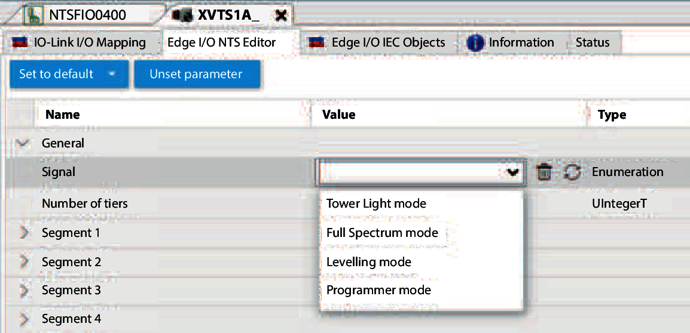

# Tower Light Settings

This chapter explains how to configure the tower lights.

With **EcoStruxureTM Machine Expert** and NTSFIO0400 field device master, operating modes be accessed and modified under the Edge I/O NTS Editor tab of each tower light. With third-party IO-Link Masters, refer to the documentation supplied by the manufacturer of your IO-Link Master to know how to proceed.

EIO0000005746.00