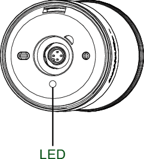

# Status LED

The functional status of the tower lights is displayed via one LED. The status LED is located in the base of the tower lights, behind the type label:

The LED colours convey the following information:

* **Red flashes** (500 ms ON, then 500 ms OFF): power supply is OFF (no IO-Link communication),
* **Red flashes** (900 ms ON, then 100 ms OFF): connection interrupted,
* **Green flashes** (900 ms ON, then 100 ms OFF): power supply is ON (IO-Link communication is working),
* **Light yellow** (permanent): firmware update is running.

If no LED is active, check the power supply and the connection cable.

EIO0000005746.00