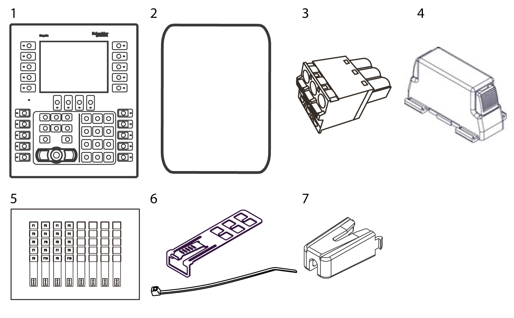

# Package Contents

Package Contents

NOTE: This product has been carefully packed with special attention to quality. However, should you find anything damaged or missing, please contact your local distributor immediately.

Verify all items listed here are present in your package:

1   Harmony GK: 1

2   Installation gasket: 1 (attached to this product)

3   DC power supply connector (straight type): 1

4   Spring clips: 5 sets for HMIGK2310, 6 sets for HMIGK5310 (2 pieces/set)

5   Insert labels: 1 sheet (2 sets of function key labels and 4 blank labels)

6   USB Clamp Type A (1 port): 1 set (1 clip and 1 tie)

7   USB Clamp mini-B (1 port): 1

8   Quick Reference Guide: 1

Revision

You can identify the product version (PV), revision level (RL), and the software version (SV) from the product label.

EIO0000002373\_01

© 2016 Schneider Electric. All rights reserved.