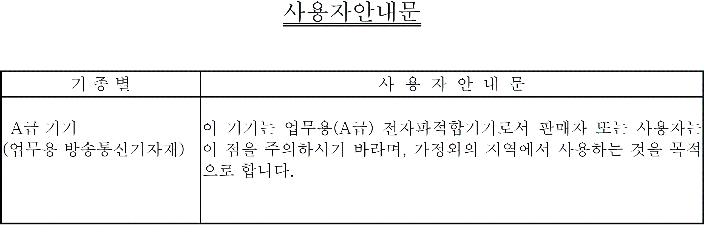

# Certifications and Standards

Certifications and Standards

NOTE: Some products are not subject to certification and standards. And some products have not received their certification and standards but are scheduled for assessment.

For information on certifications and standards, such as certified models and certificates, see the product markings or the following URL.

[www.schneider-electric.com](http://www.schneider-electric.com)

Agency Certifications

Schneider Electric submitted this product for independent testing and qualification by third-party listing agencies. These agencies have certified this product as meeting the following standards.

oUnderwriters Laboratories Inc., UL61010-2-201 and CSA C22.2 No61010-2-201, Industrial Control Equipment

oUnderwriters Laboratories Inc., ANSI/ISA 12.12.01 and CSA C22.2 No213, Electrical Equipment for Use in Class I, Division 2 Hazardous (Classified) Locations

oEAC certification (Russia, Belarus, Kazakhstan)

Compliance Standards

Europe:

CE

oDirective 2014/35/EU (Low Voltage)

oDirective 2014/30/EU (EMC)

oProgrammable Controllers: EN 61131-2

oEN61000-6-4

oEN61000-6-2

oEN61010-2-201

Australia:

oRCM

oEN61000-6-4, AS/NZS CISPR11

Korea:

oKC

oKN11

oKN61000-4 series

Qualifications Standards

Schneider Electric voluntarily tested this product to additional standards. The additional tests performed, and the standards under which the tests were conducted, are specifically identified in [Structural Specifications](../Chapter4/Chapter4-5.htm#XREF_D_SE_0059763_1).

Hazardous Substances

This product is a device for use in factory systems. When using this product in a system, the system should comply with the following standards in regards to the installation environment and handling:

oWEEE, Directive 2012/19/EU

oRoHS, Directive 2011/65/EU

oRoHS China, Standard SJ/T 11364

oREACH regulation EC 1907/2006

European (CE) Compliance

The product described in this manual comply with the European Directives concerning Electromagnetic Compatibility and Low Voltage (CE marking) when used as specified in the relevant documentation, in application for which they are specifically intended, and in connection with approved third-party products.

KC Markings

EIO0000002373\_01

© 2016 Schneider Electric. All rights reserved.