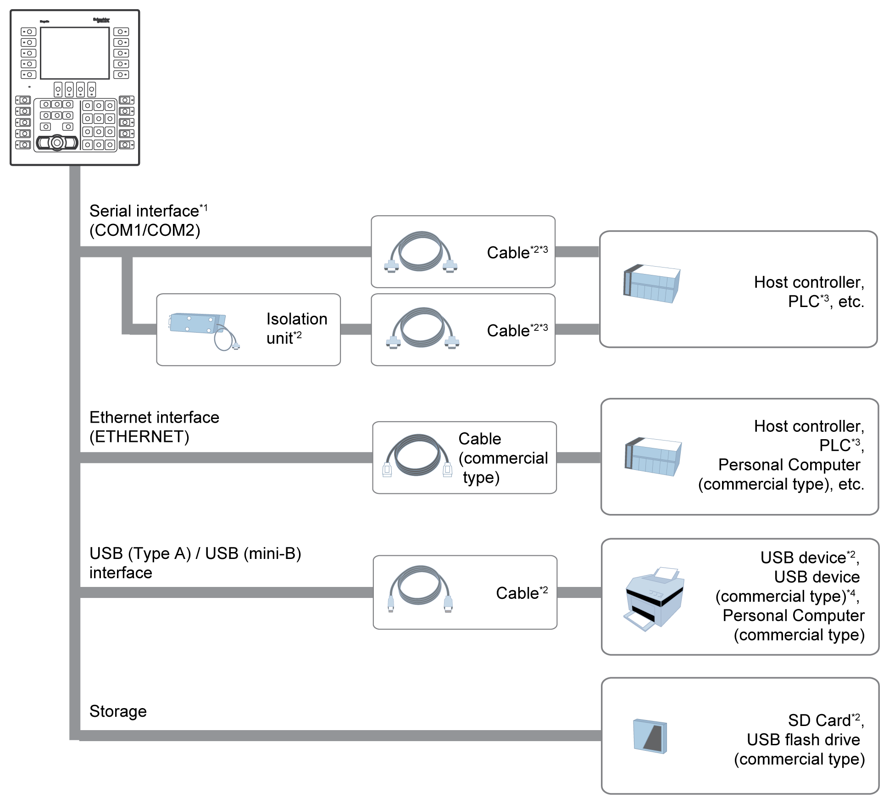

# System Design

System Design

\*1 In order to use this as an isolation port, Isolation Unit is required. To use RS-232C isolation unit, set the #9 pin of the COM1 port to VCC.

\*2 Refer to [Accessories](Zenzai-_CH_Device_Connectivity-3.htm#XREF_D_SE_0059750_1).

\*3 For information on how to connect controllers and other types of equipment, refer to the corresponding device driver manual of your screen editing software.

\*4 For supported models, contact your local Schneider Electric representative.

EIO0000002373\_01

© 2016 Schneider Electric. All rights reserved.