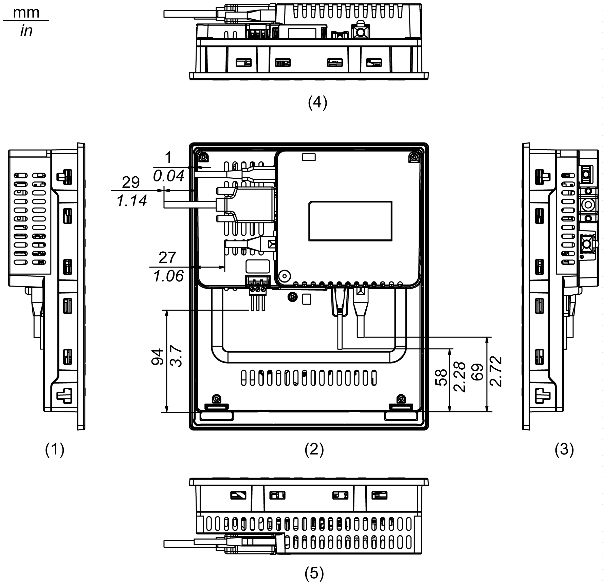
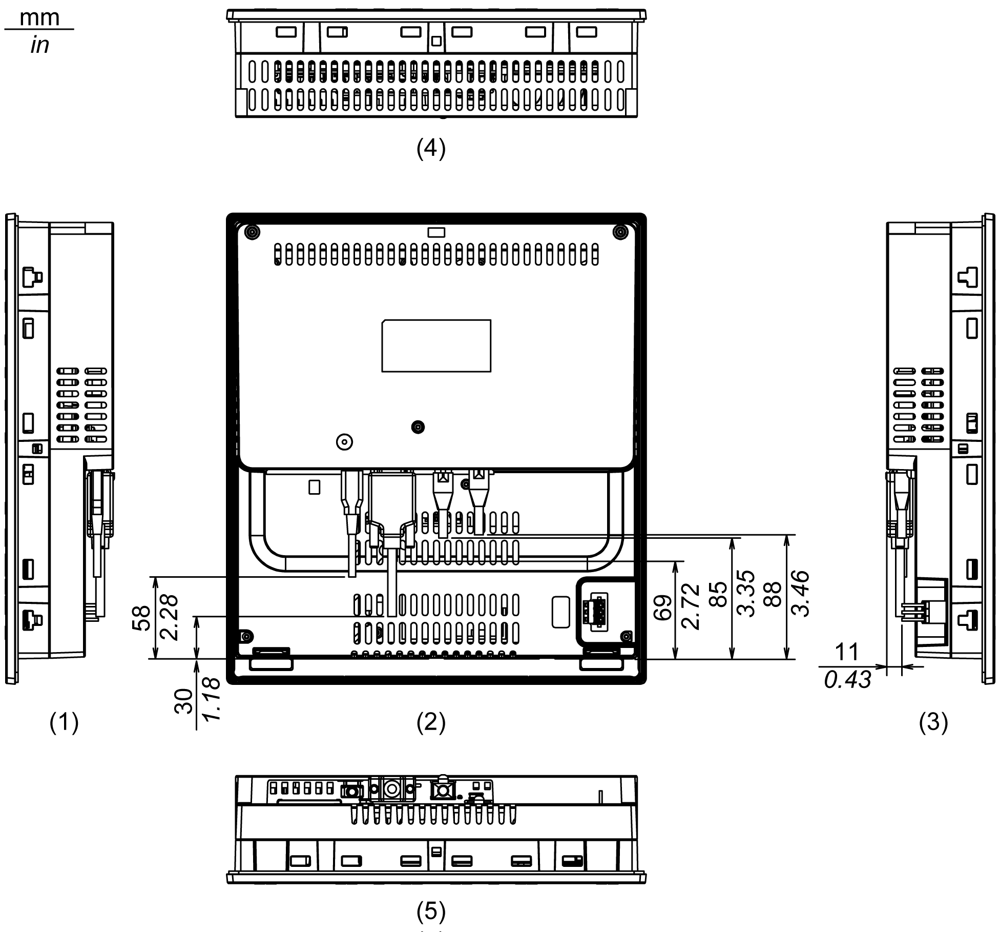

# Dimensions with Cables

Dimensions with Cables

HMIGK2310

1   Right

2   Front

3   Left

4   Bottom

5   Top

NOTE: All the above values are designed with cable bending in mind. The dimensions given here are representative values depending on the type of connection cable in use. Therefore, these values are intended for reference only.

HMIGK5310

1   Right

2   Front

3   Left

4   Bottom

5   Top

NOTE: All the above values are designed with cable bending in mind. The dimensions given here are representative values depending on the type of connection cable in use. Therefore, these values are intended for reference only.

EIO0000002373\_01

© 2016 Schneider Electric. All rights reserved.