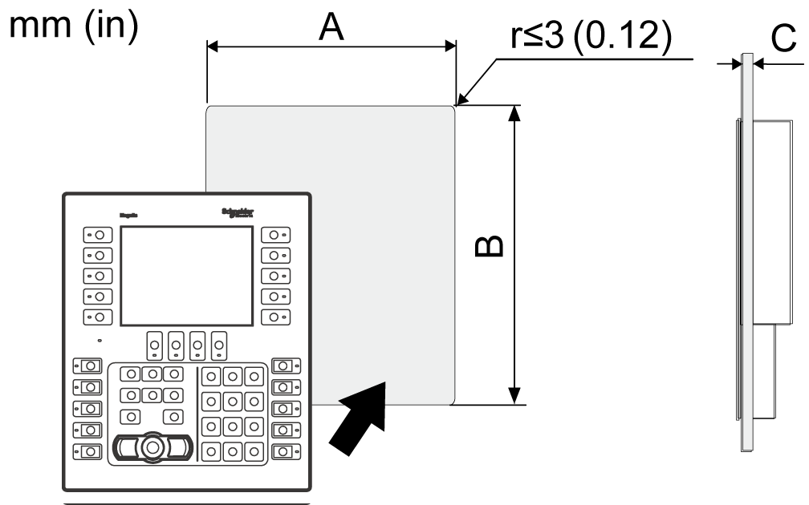

# Panel Cutout Dimensions

Panel Cutout Dimensions

Based on the panel cutout dimensions, open a mount hole on the panel.

| Model name | A | B | C |
| --- | --- | --- | --- |
| HMIGK2310 | 209±0.4 mm  (8.23±0.01 in) | 243±0.4 mm  (9.57±0.01 in) | Spring clips (Position 1): 1.5...4 mm (0.06...0.16 in)  Spring clips (Position 2): 4...6 mm (0.16...0.24 in)  NOTE: For the positions, refer to the [Installation Procedure](Chapter6-6.htm#XREF_D_SE_0059959_1). |
| HMIGK5310 | 285±0.4 mm  (11.22±0.01 in) | 309±0.4 mm  (12.17±0.01 in) |

EIO0000002373\_01

© 2016 Schneider Electric. All rights reserved.