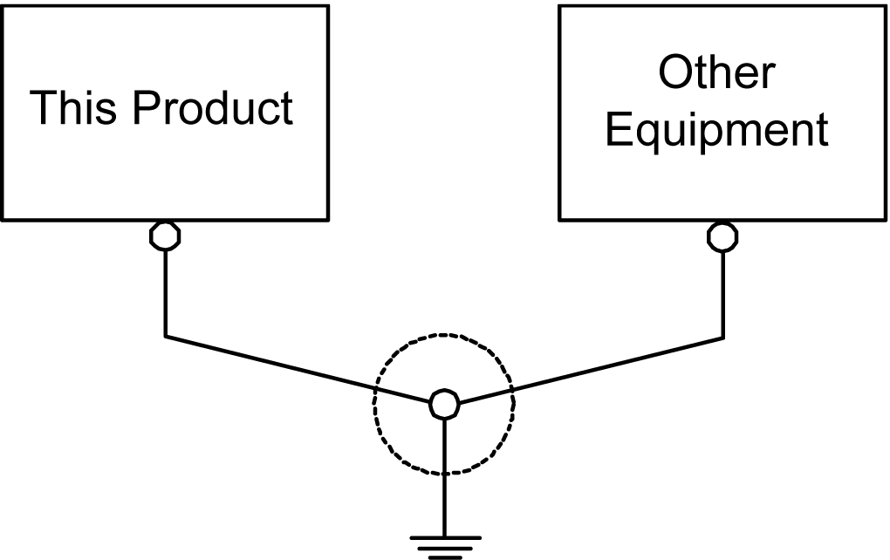
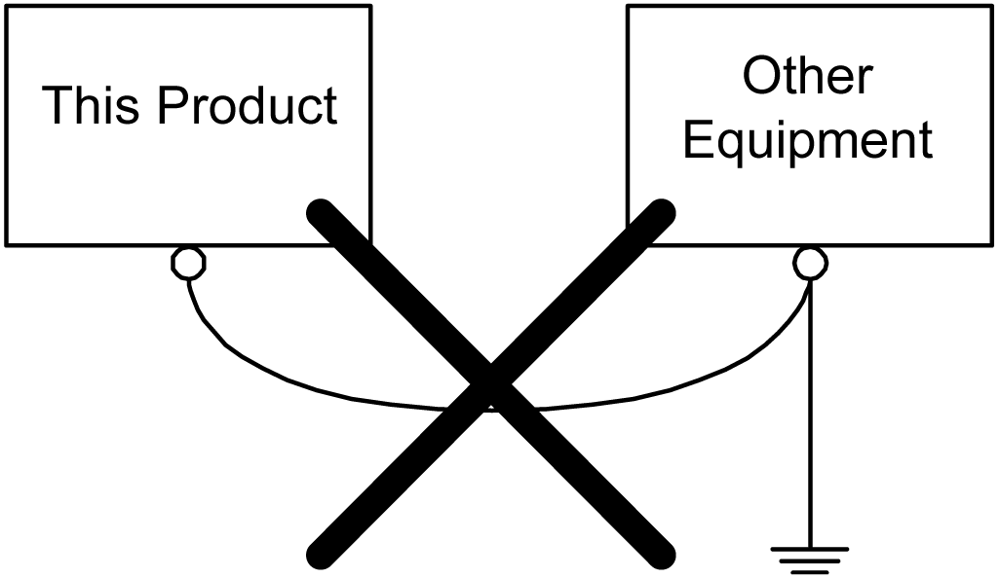

# Common Grounding

Common Grounding

Electromagnetic Interference (EMI) can be created if devices are improperly grounded. EMI can cause loss of communication. If exclusive grounding is not possible, use a common grounding point as shown in the configuration below. Do not use any other configuration for common grounding.

Correct grounding

Incorrect grounding

