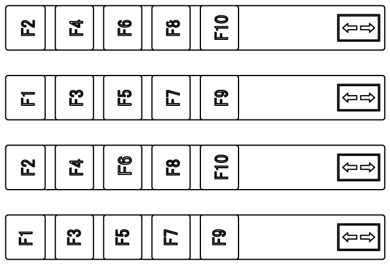
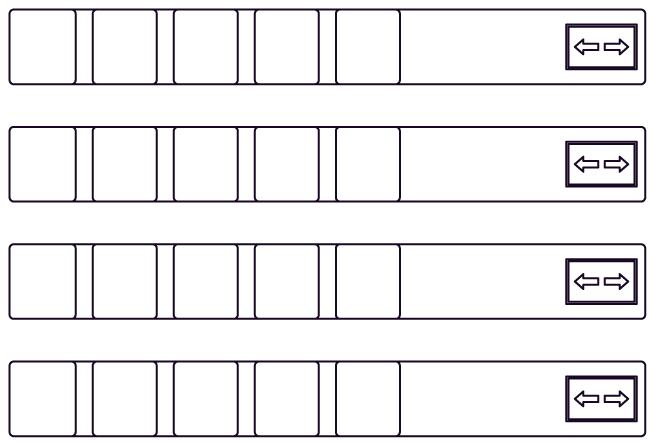

# Introduction

Introduction

You can print blank labels from your screen editing software. For more information, refer to the manual of the screen editing software. Remove the protective layer from label sheets before printing.

|  |
| --- |
| Warning_Color.gifWARNING |
| UNINTENDED EQUIPMENT OPERATION |
| Make sure that the text/symbols on your insert label always correspond to what is configured for this product in your screen editing software. |
| Failure to follow these instructions can result in death, serious injury, or equipment damage. |

|  |
| --- |
| Caution_Color.gifCAUTION |
| EQUIPMENT DAMAGE |
| oInsert the labels, align them properly, and slide the flap into the chassis slit.  oDo not pinch the flap between the product and the panel. |
| Failure to follow these instructions can result in injury or equipment damage. |

Function Key Label

Blank Label

EIO0000002373\_01

© 2016 Schneider Electric. All rights reserved.