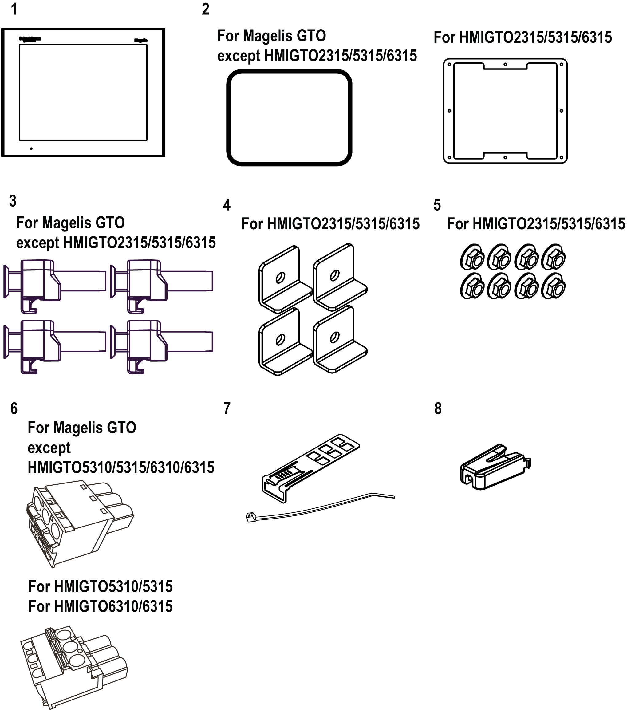
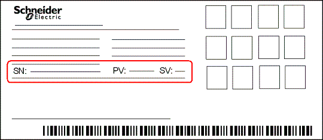

# HMIGTO Package Contents

HMIGTO Package Contents

Overview

Verify all items listed here are present in your package:

1   HMIGTO: 1

2   Installation gasket: 1 (attached to the panel)

3   Installation fasteners: 4 per set

4   Brackets: 4

5   M4 Hex Nuts: 8

6   DC power connector: 1\*1

7   USB cable clamp Type A: 1 set (1 clip and 1 tie)

8   USB cable clamp mini-B: 1 (1 USB holder)

9   HMIGTO Quick Reference Guide: 1

This product has been carefully packed with special attention to quality. However, should you find anything damaged or missing, contact your local distributor.

\*1 You can use the DC power connector for HMIGTO1300/1310/2300/2310/2315/3510/4310 to supply power to HMIGTO5310/5315/6310/6315. However the reverse is not possible. You cannot use the power connector for HMIGTO5310/5315/6310/6315 on HMIGTO1300/1310/2300/2310/2315/3510/4310.

Revision

You can identify the product version (PV), revision level (RL), and the software version (SV) from the unit product label:

EIO0000001133.05

© 2016 Schneider Electric. All rights reserved.