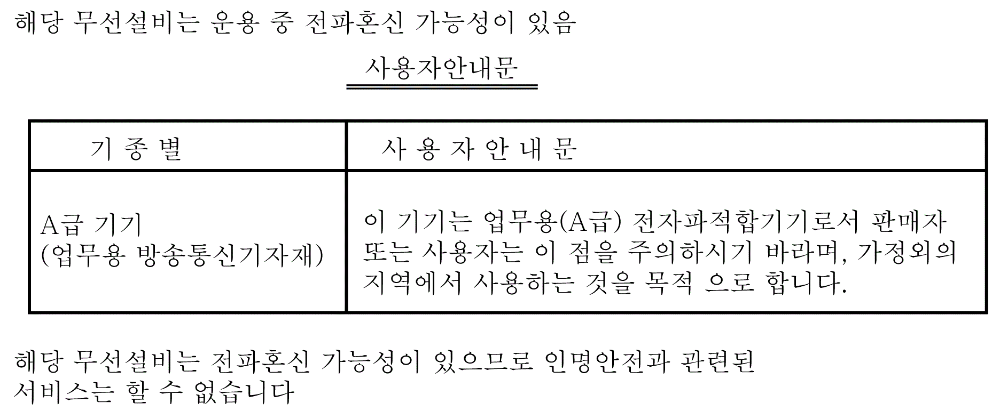

# Certifications and Standards

Certifications and Standards

Introduction

Schneider Electric submitted this product for independent testing and qualification by third-party listing agencies. These agencies have certified this product as meeting the following standards.

Agency Certifications

The HMIGTO is manufactured in accordance with:

oStandard UL 508 and CSA C22.2 no142 for Industrial Control Equipment

oStandard ANSI/ISA - 12.12.01 and CSA C22.2 no213 for Electrical Equipment for Use in Class I, Division 2 Hazardous Locations

NOTE:

oFor use in Pollution Degree 2 environments.

oFor use on a flat surface of a Type 1, Type 4X (Indoor Use Only) or Type 13 Enclosure.

o24 Vdc input panel must be used with a Class 2 power supply.

oSuitable for use in Class I, Division 2 Groups A, B, C, and D Hazardous Locations.

oGOST certification.

Refer to product markings.

oATEX certification by Technical Inspection Association.

Refer to product label.

oMerchant Navy rules. (Except Magelis GTOxxx5.)

Products are designed to comply with Merchant Navy rules.

Refer to the Schneider Electric Web site for Merchant Navy rules installation guidelines.

oStandard EN1672-2 (Magelis GTOxxx5).

oFDA regulation 21 CFR 177 (Magelis GTOxxx5).

Refer to the Schneider Electric web site for installation guidelines.

For detailed information, contact your local distributor or see the catalog & marking on the product.

Hazardous Substances

The HMIGTO is a device for use in factory systems. When using the HMIGTO in a system, the system should comply with the following standards with regard to the installation environment and handling:

oWEEE, Directive 2002/96/EC

oRoHS, Directive 2011/65/EU

oRoHS China, Standard SJ/T 11363-2006

CE Markings

This product conforms to the requirements of the following Directives for applying the CE label:

o2006/95/EC Low Voltage Directive

o2004/108/EC EMC Directive

This conformity is based on compliance with EN61000-6-4, EN61000-6-2

|  |
| --- |
| Danger_Color.gifDANGER |
| POTENTIAL FOR EXPLOSION |
| oVerify that the power, input, and output (I/O) wiring are in accordance with Class I, Division 2 wiring methods.  oSubstitution of any component may impair suitability for Class I, Division 2.  oDo not connect or disconnect equipment unless power has been switched off or the area is known to be non-hazardous.  oSecurely lock externally connected units and each interface before turning on the power supply.  oDo not use, connect, or disconnect USB cable unless area is known to be non-hazardous.  oDo not disconnect while circuit is live or unless the area is known to be free of ignitable concentrations.  oPotential electrostatic charging hazard. Wipe the front panel of the terminal with a damp cloth before turning ON. |
| Failure to follow these instructions will result in death or serious injury. |

KC Markings

EIO0000001133.05

© 2016 Schneider Electric. All rights reserved.