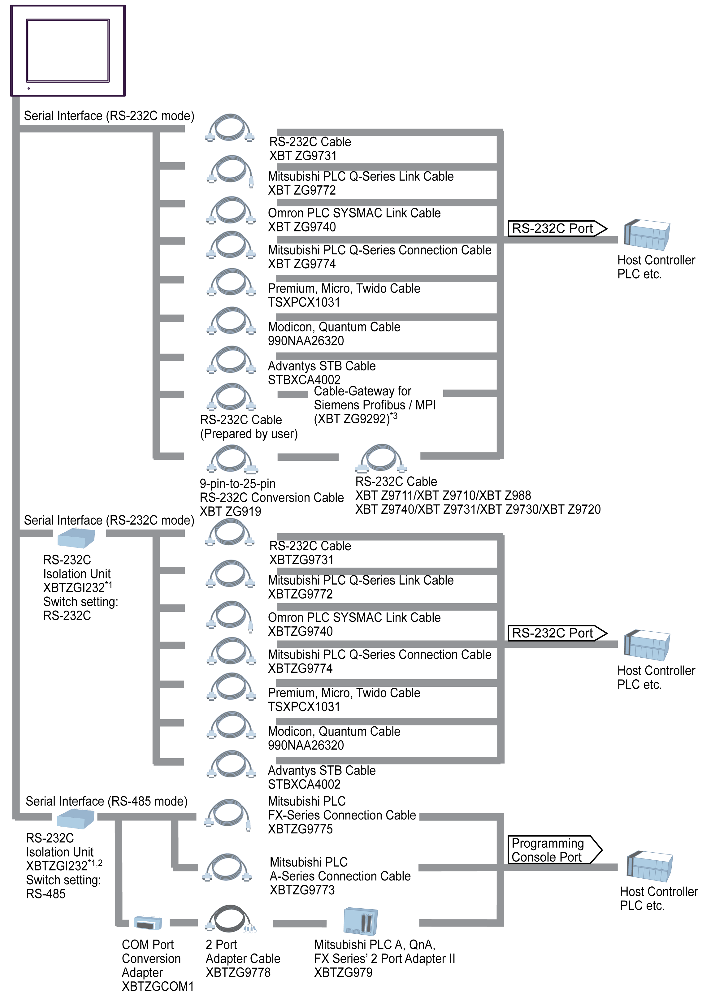
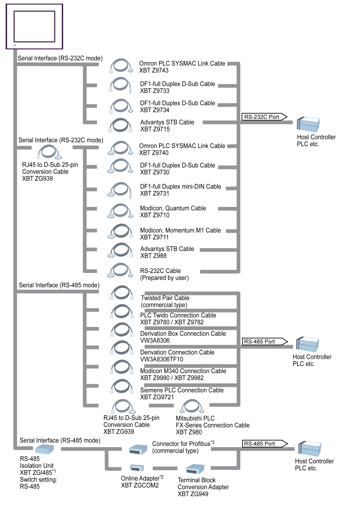
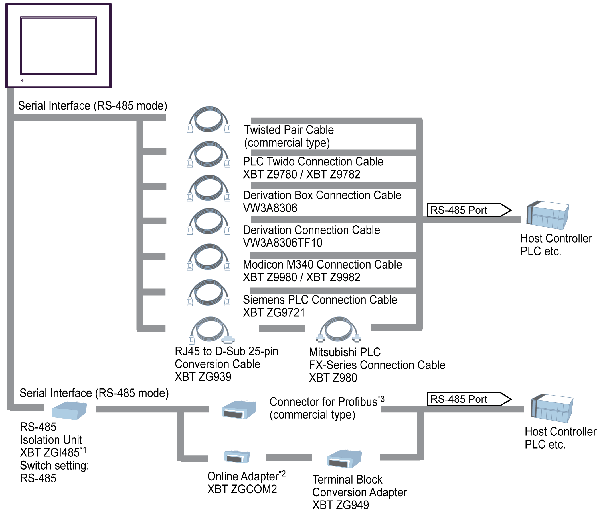

# System Design

System Design

Introduction

The following diagrams represent equipment you can connect to the panel.

|  | COM1 | COM2 |
| --- | --- | --- |
| HMIGTO1300 | [RS-232C](#XREF_D_SE_0015284_3) | [RS-485](#XREF_D_SE_0015284_5) |
| HMIGTO1310 | [RS-232C / RS-485](#XREF_D_SE_0015284_4) | – |
| HMIGTO2300 | [RS-232C](#XREF_D_SE_0015284_3) | [RS-485](#XREF_D_SE_0015284_5) |
| HMIGTO2310 |
| HMIGTO2315 |
| HMIGTO3510 |
| HMIGTO4310 |
| HMIGTO5310 |
| HMIGTO5315 |
| HMIGTO6310 |
| HMIGTO6315 |

|  |
| --- |
| Caution_Color.gifCAUTION |
| LOSS OF COMMUNICATION |
| oAll connections to the communication ports must not put excessive stress on the ports.  oSecurely attach communication cables to the panel or cabinet.  oUse only D-Sub 9-pin cables with a locking system in good condition. |
| Failure to follow these instructions can result in injury or equipment damage. |

RUN Mode Peripherals - RS-232C

\*1 When connecting the XBTZGI232, the COM port's pin 9 setting should be VCC. You can define COM port settings in Vijeo Designer or in the HMIGTO's offline menu.

\*2 The RS-232C Isolation Unit works with only RS-422/485 (4 wire) communication.

\*3 Cable-Gateway for Siemens Profibus / MPI (XBT ZG9292) is not supported by HMIGTO1310.

RUN Mode Peripherals - RS-232C / RS-485

\*1 Use the RS-485 Isolation Unit's USB port to supply power to itself. There is no need to set up a separate power supply.

\*2 In 1:n, n:1, or n:m communication, you can use the online adapter as a terminal. (Use 1 unit in either communication setup.)

\*3 The connector has a switch to control the terminal. Turn on the switch to enable communication.

RUN Mode Peripherals - RS-485

\*1 Use the RS-485 Isolation Unit's USB port to supply power to itself. There is no need to set up a separate power supply.

\*2 In 1:n, n:1, or n:m communication, you can use the online adapter as a terminal. (Use 1 unit in either communication setup.)

\*3 The connector has a switch to control the terminal. Turn on the switch to enable communication.

RUN Mode Peripherals - Ethernet Communication

RUN Mode Peripherals - USB Type A / mini-B Interface

Edit Mode Peripherals

EIO0000001133.05

© 2016 Schneider Electric. All rights reserved.