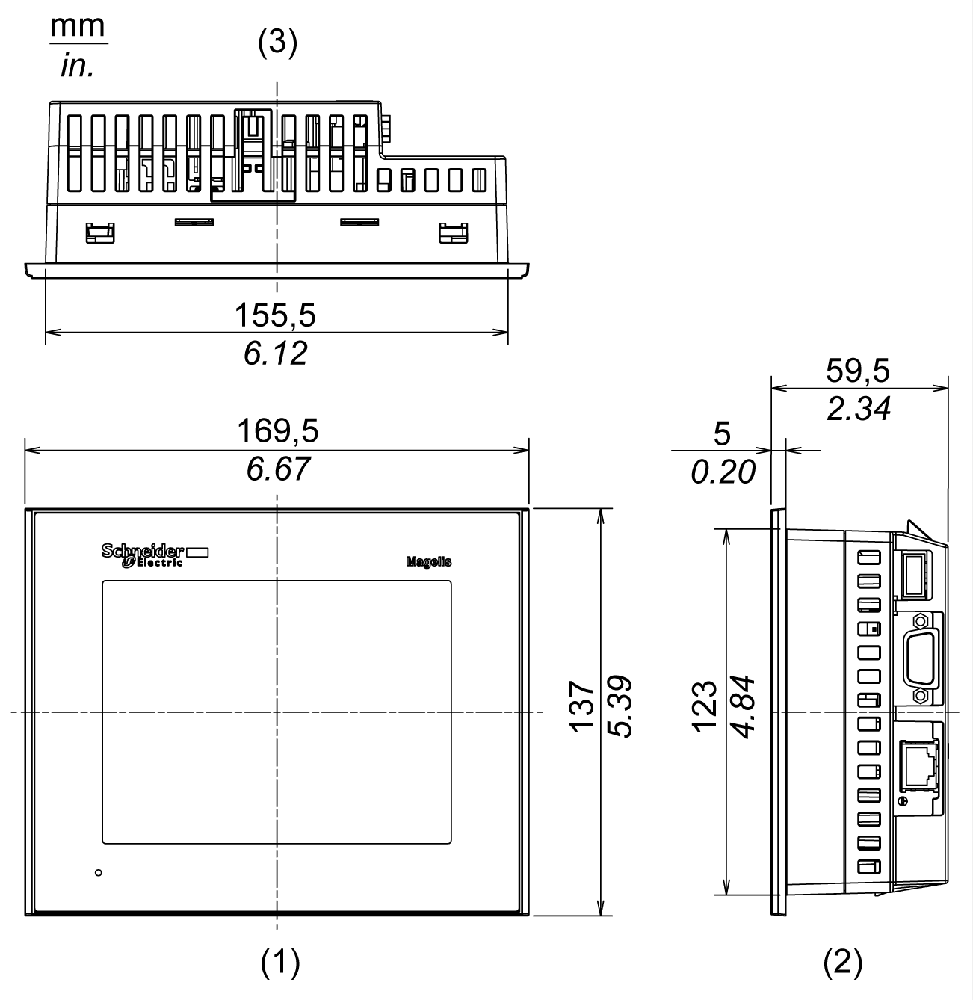
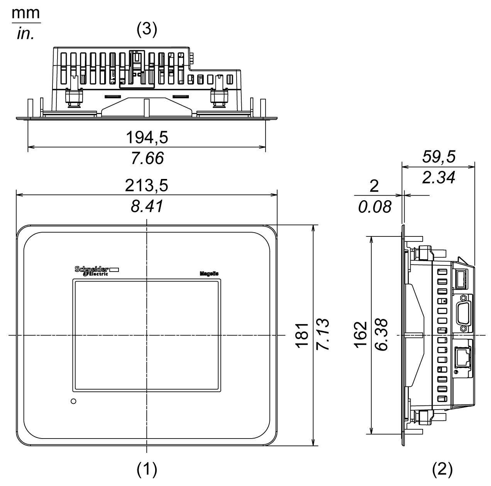
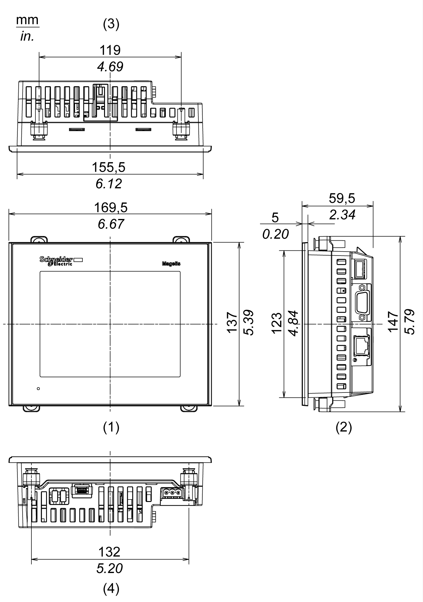
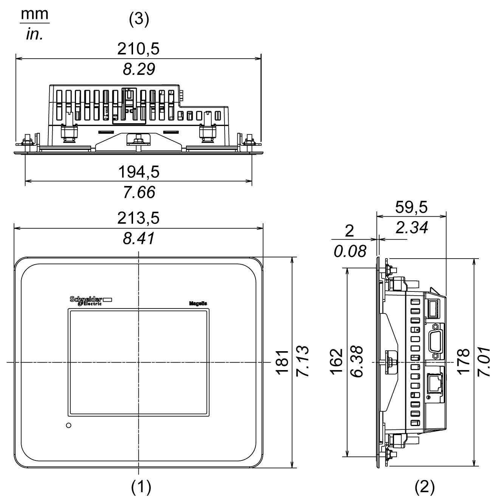
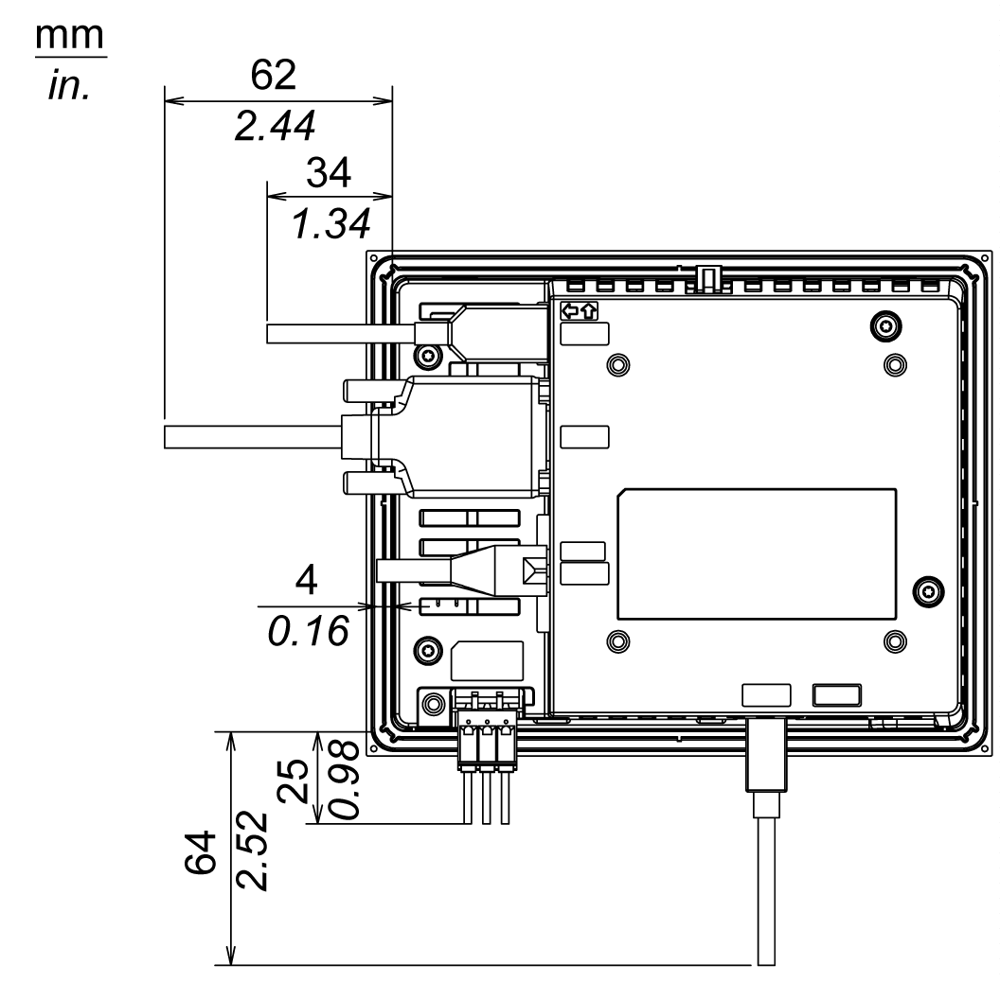
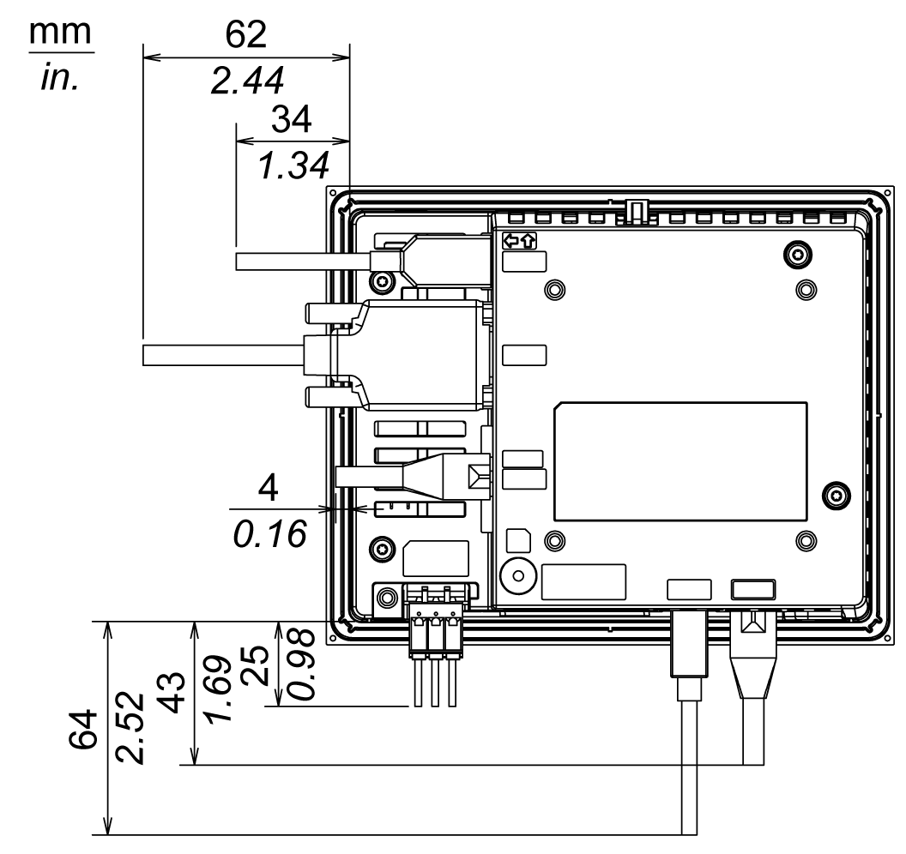
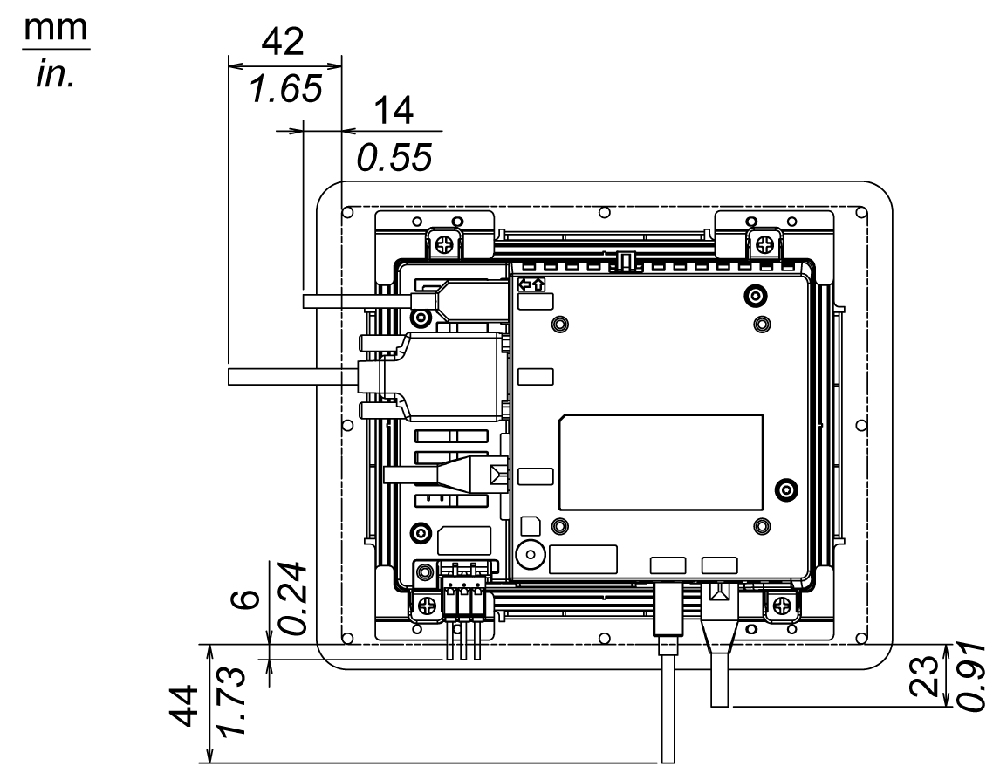

# Dimensions

Dimensions

External Dimensions: HMIGTO2300 / HMIGTO2310

1   Front

2   Right side

3   Top

External Dimensions: HMIGTO2315

1   Front

2   Right side

3   Top

Installation with Installation Fasteners: HMIGTO2300 / HMIGTO2310

1   Front

2   Right side

3   Top

4   Bottom

Installation with Installation Fasteners: HMIGTO2315

1   Front

2   Right side

3   Top

Dimensions with Cables: HMIGTO2300

NOTE: All the above values are designed with cable bending in mind. The dimensions given here are representative values depending on the type of connection cable in use. Therefore, these values are intended for reference only.

Dimensions with Cables: HMIGTO2310

NOTE: All the above values are designed with cable bending in mind. The dimensions given here are representative values depending on the type of connection cable in use. Therefore, these values are intended for reference only.

Dimensions with Cables: HMIGTO2315

NOTE: All the above values are designed with cable bending in mind. The dimensions given here are representative values depending on the type of connection cable in use. Therefore, these values are intended for reference only.

Panel Cut Dimensions

Create a panel cut and insert the panel into the opening from the front.

|  | A | B | C | R |
| --- | --- | --- | --- | --- |
| HMIGTO2310  HMIGTO2300 | 156 mm (+1/-0) mm  (6.14 in (+0.04, -0 in)) | 123.5 mm (+1, -0 mm)  (4.86 in (+0.04, -0 in)) | 1.6...5 mm  (0.06...0.2 in) | 3 mm (0.12 in)  maximum |
| HMIGTO2315 | 195 mm (+1/-0) mm  (7.68 in (+0.04, -0 in)) | 162.5 mm (+1/-0) mm  (6.40 in (+0.04, -0 in)) |

NOTE: Before designing the panel cut, refer to Installation.

Installation Fastener Dimensions

EIO0000001133.05

© 2016 Schneider Electric. All rights reserved.