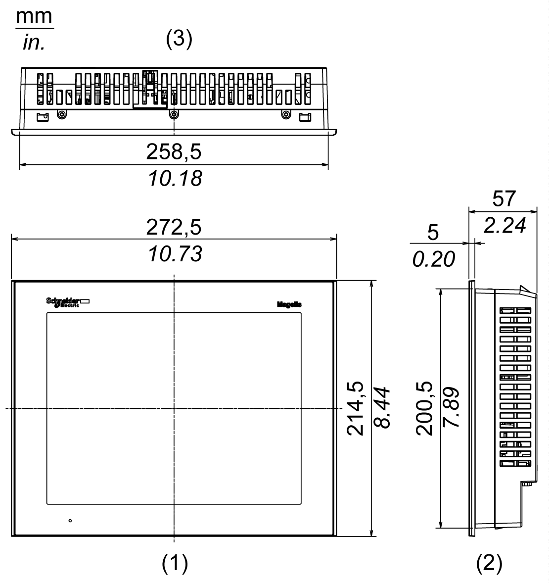
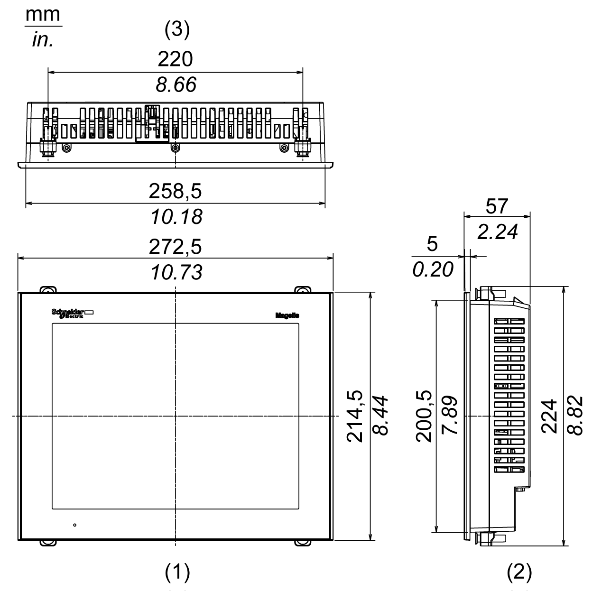

# Dimensions

Dimensions

External Dimensions: HMIGTO5310

1   Front

2   Right side

3   Top

External Dimensions: HMIGTO5315

1   Front

2   Right side

3   Top

Installation with Installation Fasteners: HMIGTO5310

1   Front

2   Right side

3   Top

Installation with Installation Fasteners: HMIGTO5315

1   Front

2   Right side

3   Top

Dimensions with Cables: HMIGTO5310

NOTE: All the above values are designed with cable bending in mind. The dimensions given here are representative values depending on the type of connection cable in use. Therefore, these values are intended for reference only.

Dimensions with Cables: HMIGTO5315

NOTE: All the above values are designed with cable bending in mind. The dimensions given here are representative values depending on the type of connection cable in use. Therefore, these values are intended for reference only.

Panel Cut Dimensions

Create a panel cut and insert the panel into the opening from the front.

|  | A | B | C | R |
| --- | --- | --- | --- | --- |
| HMIGTO5310 | 259 mm (+1, -0 mm)  (10.2 in (+0.04, -0 in)) | 201 mm (+1, -0 mm)  (7.91 in (+0.04, -0 in)) | 1.6...5 mm  (0.06...0.2 in) | 3 mm (0.12 in)  maximum |
| HMIGTO5315 | 298 mm (+1, -0 mm)  (11.73 in (+0.04, -0 in)) | 240 mm (+1, -0 mm)  (9.45 in (+0.04, -0 in)) |

NOTE: Before designing the panel cut, refer to Installation.

Installation Fastener Dimensions

EIO0000001133.05

© 2016 Schneider Electric. All rights reserved.