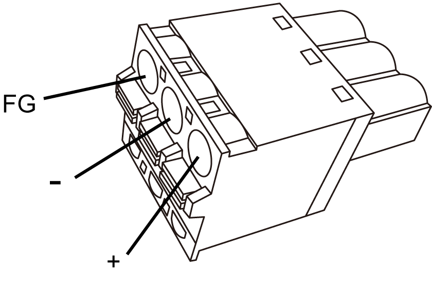
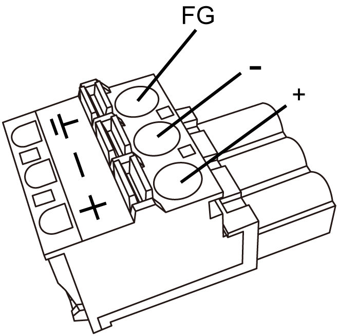

# Connecting the Power Cord

Connecting the Power Cord

|  |
| --- |
| Warning_Color.gifWARNING |
| EXCESSIVE ELECTROMAGNETIC INTERFERENCE |
| oWhen the functional ground (FG) terminal is connected, be sure the wire is grounded. Not grounding the HMIGTO can result in excessive Electromagnetic Interference (EMI). Grounding is required to meet EMC level immunity.  oRemove power before wiring the HMIGTO’s power terminals.  oThe DC model uses only 24 Vdc power. Using any other level of power can damage both the power supply and the HMIGTO.  oSince the HMIGTO is not equipped with a power switch, be sure to connect a power switch to the power supply.  oBe sure to ground the HMIGTO's FG terminal.  oReplace and secure all elements of the system before applying power to the HMIGTO. |
| Failure to follow these instructions can result in death, serious injury, or equipment damage. |

NOTE: The shield ground (SG) and FG terminals are connected internally in the panel.

DC Power Cord Preparation

oMake sure that the ground wire is either the same or heavier gauge than the power wires.

oDo not use aluminum wires in the power supply's power cord.

oIf the ends of the individual wires are not twisted correctly, the wires may create a short circuit.

oWherever possible, use wires that are 0.75 to 2.5 mm2 (AWG 18 - 13) for the power cord, and twist the wire ends before attaching the terminals.

oThe conductor type is solid or stranded wire.

oField wiring terminal marking for wire type (75 °C [167 °F] copper conductors only).

DC Power Supply Connector (Plug) Specifications: Spring Clamp Terminal Blocks

HMIGTO1300/1310 / HMIGTO2300/2310/2315 / HMIGTO3510/4310

HMIGTO5310/5315 / HMIGTO6310/6315

| Connection | Wire |
| --- | --- |
| + | 24 Vdc |
| - | 0 Vdc |
| FG | Grounded terminal connected to the panel chassis. |

How to Connect the DC Power Cord

| Step | Action |
| --- | --- |
| 1 | Confirm that the power cord is not connected to the power supply. |
| 2 | Check the rated voltage and remove the “DC24V” sticker on the DC power supply connector. |
| 3 | Remove 10 mm (0.39 in) of the vinyl membrane off the ends of the power cord wires. |
| 4 | If using stranded wire, twist the ends. Tinning the ends with solder reduces risk of fraying and ensures good electrical transfer. |
| 5 | Push the Opening button with a small and flat screwdriver to open the desired pin hole. |
| 6 | Insert each pin terminal into its corresponding hole. Release the Opening button to clamp the pin in place.  G-SE-0049304.2.gif-high.gif |
| 7 | After inserting all three pins, insert the power plug into the power connector on the panel. |

NOTE:

oDo not solder the wire directly to the power receptacle pin.

oTo prevent the possibility of a terminal short, use a pin terminal that has an insulating sleeve.

oYou can use the DC power connector for HMIGTO1300/1310 / HMIGTO2300/2310/2315 / HMIGTO3510/4310 to supply power to HMIGTO5310/5315 / HMIGTO6310/6315. However the reverse is not possible. You cannot use the power connector for HMIGTO5310/5315 / HMIGTO6310/6315 on HMIGTO1300/1310 / HMIGTO2300/2310/2315 / HMIGTO3510/4310.

EIO0000001133.05

© 2016 Schneider Electric. All rights reserved.