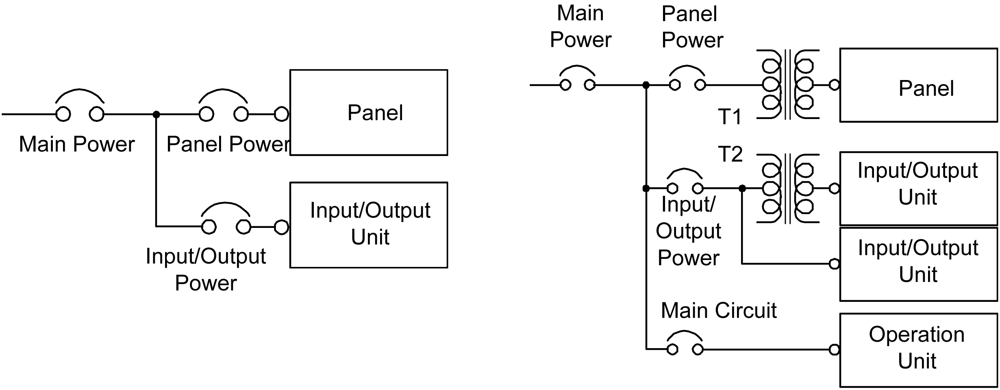
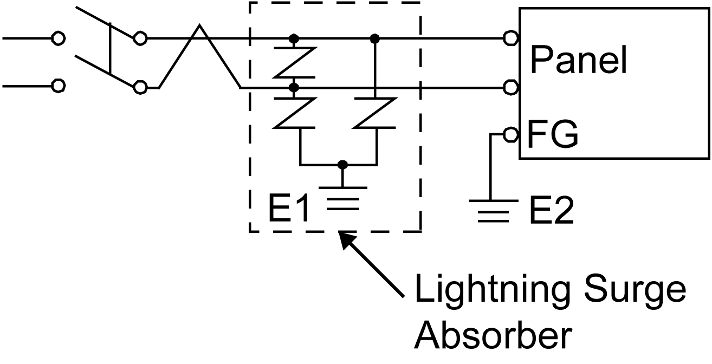
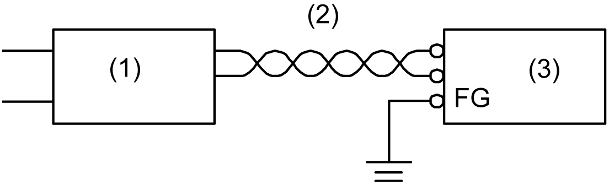

# Connecting the Power Supply

Connecting the Power Supply

Precautions

oYou must use a 24 Vdc input unit with a Class 2 power supply.

oTo increase the electromagnetic noise resistance, make sure that you twist the ends of the power cord wires before connecting them to the power plug.

oThe panel's power supply cord should not be bundled with or kept close to main circuit lines (high voltage, high current), or input/output signal lines.

oConnect a lightning surge absorber to handle power surges.

oTo reduce electromagnetic noise, make the power cord as short as possible.

|  |
| --- |
| Warning_Color.gifWARNING |
| SHORT CIRCUIT, FIRE, OR UNINTENDED EQUIPMENT OPERATION |
| Avoid excessive force on the power cable to prevent accidental disconnection  oSecurely attach power cables to the HMIGTO or cabinet.  oUse the designated torque to tighten the unit terminal block screws.  oInstall and fasten the HMIGTO on installation panel or cabinet prior to connecting power supply and communication lines. |
| Failure to follow these instructions can result in death, serious injury, or equipment damage. |

Power Supply Connections

When supplying power to the panel, separate the input/output and power lines, as shown.

NOTE:

The following shows a lightning surge absorber connection:

oGround the surge absorber (E1) separately from the panel (E2).

oSelect a surge absorber that has a maximum circuit voltage greater than that of the peak voltage of the power supply.

If the supplied voltage exceeds the panel range, connect a constant voltage transformer.

1   Constant voltage transformer

2   Twisted-pair cord

3   panel

Select a power supply low in noise for between the line and ground. If there is an excess amount of noise, connect an insulating transformer.

1   Insulating transformer

2   Twisted-pair cord

3   panel

NOTE: Use constant voltage and insulating transformers with capacities exceeding the Power Consumption value.

EIO0000001133.05

© 2016 Schneider Electric. All rights reserved.