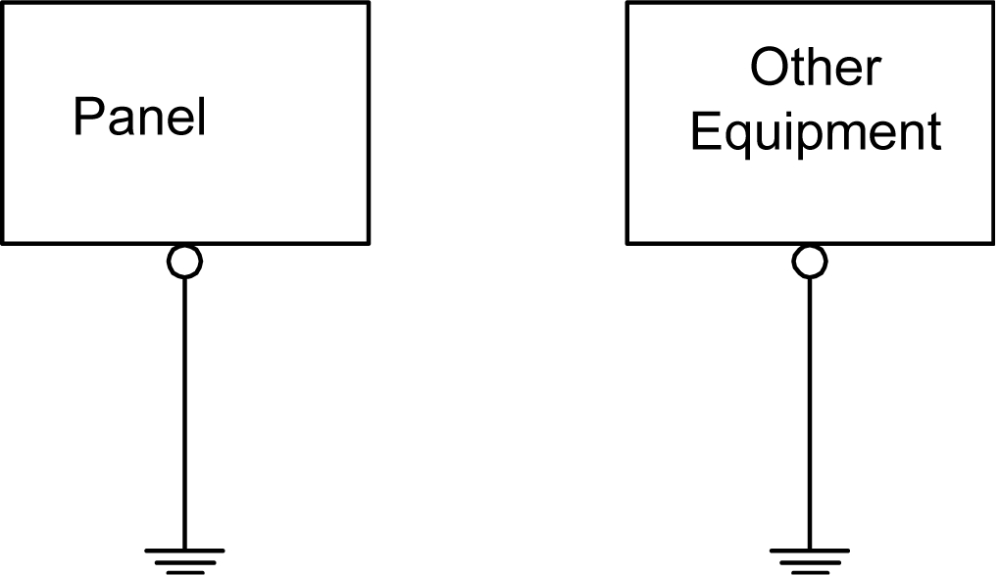
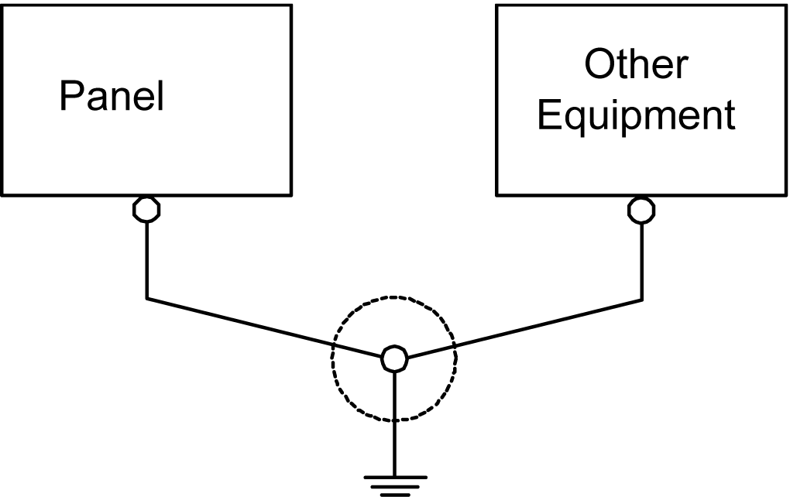
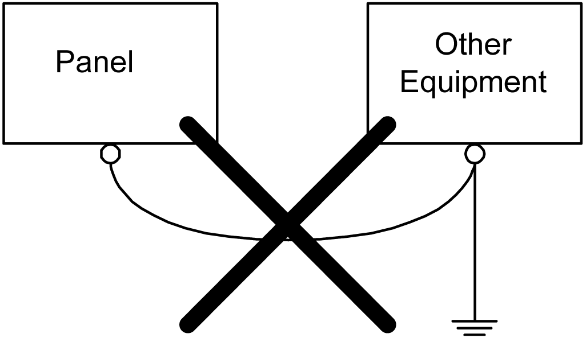

# Grounding

Grounding

Exclusive Grounding

When supplying power to the panel, separate the input/output and power lines as shown below.

Connect the frame ground (FG) terminal on the power plug to an exclusive ground.

Precautions

Electromagnetic Interference (EMI) can be created if the devices are improperly grounded. EMI can cause loss of communication. Do not use common grounding, except for the authorized configuration described below. If exclusive grounding is not possible, use a common grounding point.

Correct grounding

Incorrect grounding

oCheck that the grounding resistance is 100 Ω or less.\*1

oThe FG wire should have a cross sectional area greater than 2 mm2 (AWG 14) (1). Create the connection point as close to the panel as possible, and make the wire as short as possible. When using a long grounding wire, replace the thin wire with a thicker wire, and place it in a duct.

oFG and SG terminals are internally connected in the panel. When connecting an external device to the panel using the SG terminal, check that you do not create a short-circuit loop when you set up the system.

\*1 Observe local codes and standards. Ensure that the ground connection has a resistance of 100 Ω and that the ground wire has a cross-section of at least 2 mm2 or AWG 14.

EIO0000001133.05

© 2016 Schneider Electric. All rights reserved.