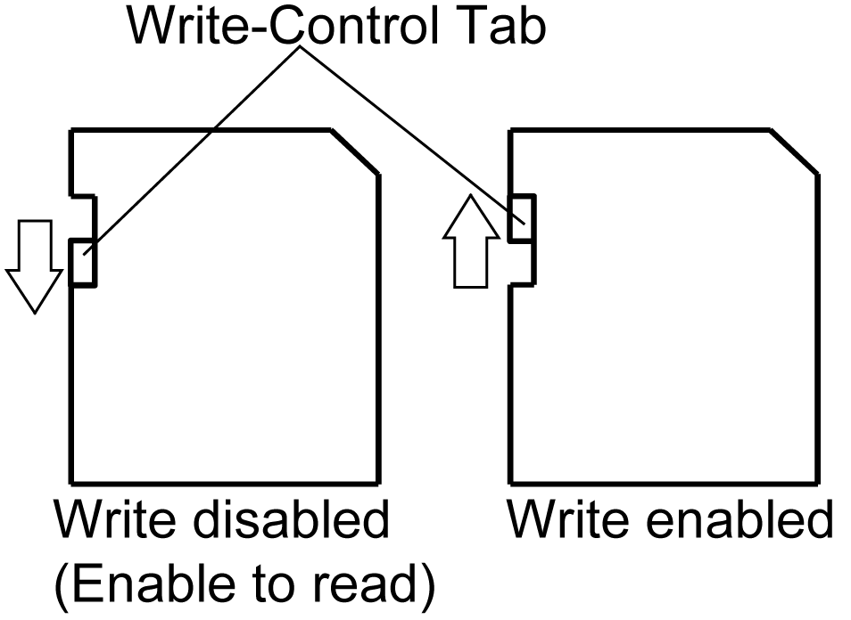

# Inserting the SD Card

Inserting the SD Card

NOTE: As shown in the image below (example on the left-hand side), you can set the Write-Control Tab to prevent write operations to the SD Card. Push the tab up, as shown in the example on the right-hand side, to release the lock and enable writing to the SD Card. Before using a commercial-type SD Card, read the manufacturer's instructions.

| Step | Action |
| --- | --- |
| 1 | Pull on the tab and open the SD Card cover.  G-SE-0016475.1.gif-high.gif      1   Tab |
| 2 | Insert the SD Card into the SD Card interface, and push until you hear it “click”.  G-SE-0015009.1.gif-high.gif |
| 3 | Close the SD Card cover. |

EIO0000001133.05

© 2016 Schneider Electric. All rights reserved.