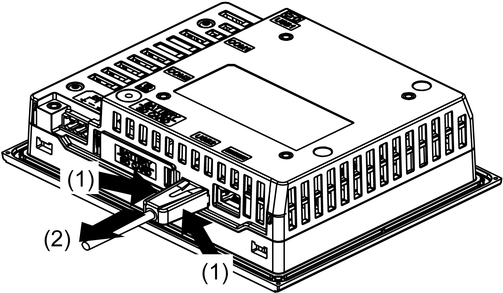

# USB Holder for USB (mini-B)

USB Holder for USB (mini-B)

Introduction

When using a USB device, you can attach a USB holder to the USB (mini-B) interface to prevent the USB cable from being disconnected.

|  |
| --- |
| Danger_Color.gifDANGER |
| POTENTIAL FOR EXPLOSION |
| oVerify the power, input, and output (I/O) wiring are in accordance with Class I, Division 2 wiring methods.  oSubstitution of any components may impair suitability for Class I, Division 2.  oConfirm that the USB cable has been fixed with the USB cable clamp before using the USB interface.  oRemove power before attaching or detaching any connectors to or from the unit. |
| Failure to follow these instructions will result in death or serious injury. |

Attaching the USB Holder

| Step | Action |
| --- | --- |
| 1 | Insert the USB cable into the USB (mini-B) interface.  G-SE-0016479.2.gif-high.gif      1   USB cable |
| 2 | Attach the USB holder to fix the USB cable in place. Insert the USB holder into the USB (mini-B) interface.  G-SE-0016480.2.gif-high.gif      1   USB holder  2   USB cable |

Removing the USB Holder

Remove the USB holder by pressing the tabs from the sides.

EIO0000001133.05

© 2016 Schneider Electric. All rights reserved.