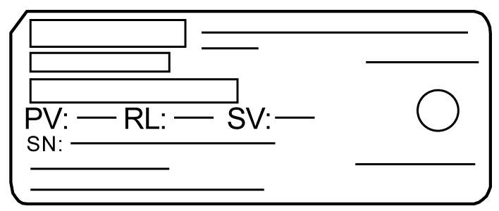

# Package Contents

Package Contents

NOTE: This product has been carefully packed with special attention to quality. However, should you find anything damaged or missing, please contact your local distributor immediately.

Box Module

Verify all items listed here are present in your package:

1   Harmony GTU Box Module: 1

2   USB Clamp Type A (1 port): 2 sets for Standard Box and Premium Box, 3 sets for Open Box (1 set = 1 clip and 1 tie)

3   Harmony GTU (Box Module) Quick Reference Guide: 1

4   Restore DVD (only for Open Box): 1

5   End-user License Agreement (only for Open Box): 2

Display Module

Verify all items listed here are present in your package:

1   Harmony GTU Display Module: 1

2   Installation Gasket: 1 (attached to this product)

3   DC Power Supply Connector (Right-angle\*1): 1

4   Harmony GTU (Display Module) Quick Reference Guide: 1

\*1 Straight type for HMIDT351

Revision

You can identify the product version (PV), revision level (RL), and the software version (SV) from the product label.

EIO0000001735\_05

© 2017 Schneider Electric. All rights reserved.