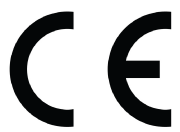
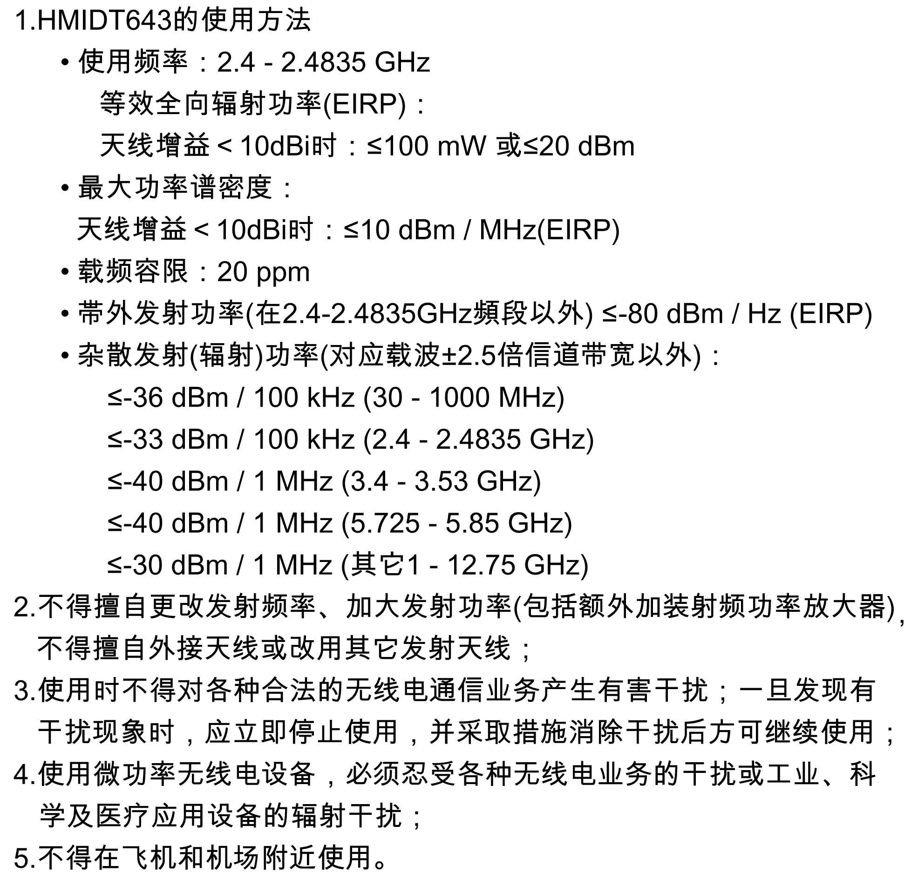
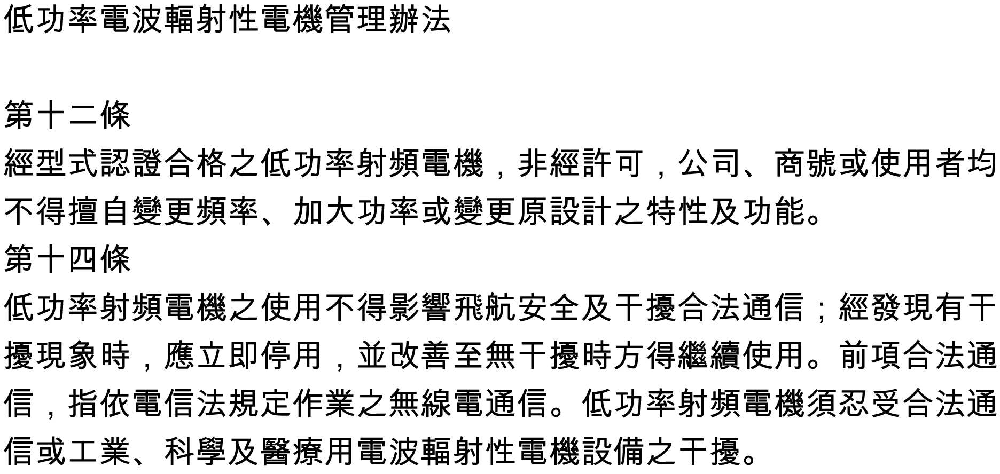
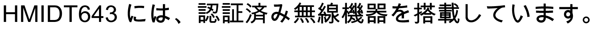

# Wireless LAN Information

Wireless LAN Information

USA

HMIDT643 contains Transmitter Module FCC ID: N6C-SDMGN.

FCC CAUTION

Changes or modifications not expressly approved by the party responsible for compliance could void the user’s authority to operate the equipment.

NOTE: This equipment has been tested and found to comply with the limits for a Class A digital device, pursuant to part 15 of the FCC Rules. These limits are designed to provide reasonable protection against harmful interference when the equipment is operated in a commercial environment. This equipment generates, uses, and can radiate radio frequency energy and, if not installed and used in accordance with the instruction manual, may cause harmful interference to radio communications. Operation of this equipment in a residential area is likely to cause harmful interference in which case the user will be required to correct the interference at his own expense.

This transmitter must not be co-located or operated in conjunction with any other antenna or transmitter.

This equipment complies with FCC radiation exposure limits set forth for an uncontrolled environment and meets the FCC radio frequency (RF) Exposure Guidelines in Supplement C to OET65. This equipment should be installed and operated keeping the radiator at least 20 cm or more away from person’s body (excluding extremities: hands, wrists, feet and ankles).

Canada

HMIDT643 contains Transmitter Module IC: 4908B-SDMGN.

This device complies with Industry Canada licence-exempt RSS standard(s). Operation is subject to the following two conditions: (1) this device may not cause interference, and (2) this device must accept any interference, including interference that may cause undesired operation of the device.

Le présent appareil est conforme aux CNR d'Industrie Canada applicables aux appareils radio exempts de licence. L'exploitation est autorisée aux deux conditions suivantes : (1) l'appareil ne doit pas produire de brouillage, et (2) l'utilisateur de l'appareil doit accepter tout brouillage radioélectrique subi, même si le brouillage est susceptible d'en compromettre le fonctionnement.

This equipment complies with IC radiation exposure limits set forth for an uncontrolled environment and meets RSS-102 of the IC radio frequency (RF) Exposure rules. This equipment should be installed and operated keeping the radiator at least 20 cm or more away from person’s body (excluding extremities: hands, wrists, feet and ankles).

Cet équipement est conforme aux limites d’exposition aux rayonnements énoncées pour un environnement non contrôlé et respecte les règles d’exposition aux fréquences radioélectriques (RF) CNR-102 de l’IC. Cet équipement doit être installé et utilisé en gardant une distance de 20 cm ou plus entre le dispositif rayonnant et le corps (à l’exception des extrémités : mains, poignets, pieds et chevilles).

Europe

EN300 328, EN301 489, EN60950-1

HMIDT643 may be operated in Belgium, Bulgaria, Czech Republic, Denmark, Germany, Estonia, Greece, Spain, France, Ireland, Italy, Cyprus, Latvia, Lithuania, Luxembourg, Malta, Hungary, Netherlands, Austria, Poland, Portugal, Romania, Slovak Republic, Slovenia, Finland, Sweden, United Kingdom.

|  |  |
| --- | --- |
| [EN]  English | Hereby, Schneider Electric declares that the radio equipment type HMIDT643 is in compliance with Directive 2014/53/EU. The full text of the EU declaration of conformity is available at the following Internet address: http://www.schneider-electric.com |
| [BG]  Bulgarian | С настоящото Schneider Electric декларира, че този тип радиосъоръжение HMIDT643 е в съответствие с Директива 2014/53/ЕС. Цялостният текст на ЕС декларацията за съответствие може да се намери на следния интернет адрес: http://www.schneider-electric.com |
| [CS]  Czech | Tímto Schneider Electric prohlašuje, že typ rádiového zařízení HMIDT643 je v souladu se směrnicí 2014/53/EU. Úplné znění EU prohlášení o shodě je k dispozici na této internetové adrese: http://www.schneider-electric.com |
| [DA]  Danish | Hermed erklærer Schneider Electric, at radioudstyrstypen HMIDT643 er i overensstemmelse med direktiv 2014/53/EU. EU-overensstemmelseserklæringens fulde tekst kan findes på følgende internetadresse: http://www.schneider-electric.com |
| [DE]  German | Hiermit erklärt Schneider Electric, dass der Funkanlagentyp HMIDT643 der Richtlinie 2014/53/EU entspricht. Der vollständige Text der EU-Konformitätserklärung ist unter der folgenden Internetadresse verfügbar: http://www.schneider-electric.com |
| [ET]  Estonian | Käesolevaga deklareerib Schneider Electric, et käesolev raadioseadme tüüp HMIDT643 vastab direktiivi 2014/53/EL nõuetele. ELi vastavusdeklaratsiooni täielik tekst on kättesaadav järgmisel internetiaadressil: http://www.schneider-electric.com |
| [EL]  Greek | Με την παρούσα ο/η Schneider Electric, δηλώνει ότι ο ραδιοεξοπλισμός HMIDT643 πληροί την οδηγία 2014/53/ΕΕ. Το πλήρες κείμενο της δήλωσης συμμόρφωσης ΕΕ διατίθεται στην ακόλουθη ιστοσελίδα στο διαδίκτυο: http://www.schneider-electric.com |
| [ES]  Spanish | Por la presente, Schneider Electric declara que el tipo de equipo radioeléctrico HMIDT643 es conforme con la Directiva 2014/53/UE. El texto completo de la declaración UE de conformidad está disponible en la dirección Internet siguiente: http://www.schneider-electric.com |
| [FR]  French | Le soussigné, Schneider Electric, déclare que l'équipement radioélectrique du type HMIDT643 est conforme à la directive 2014/53/UE. Le texte complet de la déclaration UE de conformité est disponible à l'adresse internet suivante: http://www.schneider-electric.com |
| [IT]  Italian | Il fabbricante, Schneider Electric, dichiara che il tipo di apparecchiatura radio HMIDT643 è conforme alla direttiva 2014/53/UE. Il testo completo della dichiarazione di conformità UE è disponibile al seguente indirizzo Internet: http://www.schneider-electric.com |
| [LV]  Latvian | Ar šo Schneider Electric deklarē, ka radioiekārta HMIDT643 atbilst Direktīvai 2014/53/ES. Pilns ES atbilstības deklarācijas teksts ir pieejams šādā interneta vietnē: http://www.schneider-electric.com |
| [LT]  Lithuanian | Aš, Schneider Electric, patvirtinu, kad radijo įrenginių tipas HMIDT643 atitinka Direktyvą 2014/53/ES. Visas ES atitikties deklaracijos tekstas prieinamas šiuo interneto adresu: http://www.schneider-electric.com |
| [HR]  Croatian | Schneider Electric ovime izjavljuje da je radijska oprema tipa HMIDT643 u skladu s Direktivom 2014/53/EU. Cjeloviti tekst EU izjave o sukladnosti dostupan je na sljedećoj internetskoj adresi: http://www.schneider-electric.com |
| [HU]  Hungarian | Schneider Electric igazolja, hogy a HMIDT643 típusú rádióberendezés megfelel a 2014/53/EU irányelvnek. Az EU-megfelelőségi nyilatkozat teljes szövege elérhető a következő internetes címen: http://www.schneider-electric.com |
| [MT]  Maltese | B'dan, Schneider Electric, niddikjara li dan it-tip ta' tagħmir tar-radju HMIDT643 huwa konformi mad-Direttiva 2014/53/UE. It-test kollu tad-dikjarazzjoni ta' konformità tal-UE huwa disponibbli f'dan l-indirizz tal-Internet li ġej: http://www.schneider-electric.com |
| [NL]  Dutch | Hierbij verklaar ik, Schneider Electric, dat het type radioapparatuur HMIDT643 conform is met Richtlijn 2014/53/EU. De volledige tekst van de EU-conformiteitsverklaring kan worden geraadpleegd op het volgende internetadres: http://www.schneider-electric.com |
| [PL]  Polish | Schneider Electric niniejszym oświadcza, że typ urządzenia radiowego HMIDT643 jest zgodny z dyrektywą 2014/53/UE. Pełny tekst deklaracji zgodności UE jest dostępny pod następującym adresem internetowym: http://www.schneider-electric.com |
| [PT]  Portuguese | O(a) abaixo assinado(a) Schneider Electric declara que o presente tipo de equipamento de rádio HMIDT643 está em conformidade com a Diretiva 2014/53/UE. O texto integral da declaração de conformidade está disponível no seguinte endereço de Internet: http://www.schneider-electric.com |
| [RO]  Romanian | Prin prezenta, Schneider Electric declară că tipul de echipamente radio HMIDT643 este în conformitate cu Directiva 2014/53/UE. Textul integral al declaraţiei UE de conformitate este disponibil la următoarea adresă internet: http://www.schneider-electric.com |
| [SK]  Slovak | Schneider Electric týmto vyhlasuje, že rádiové zariadenie typu HMIDT643 je v súlade so smernicou 2014/53/EÚ. Úplné EÚ vyhlásenie o zhode je k dispozícii na tejto internetovej adrese: http://www.schneider-electric.com |
| [SL]  Slovenian | Schneider Electric potrjuje, da je tip radijske opreme HMIDT643 skladen z Direktivo 2014/53/EU. Celotno besedilo izjave EU o skladnosti je na voljo na naslednjem spletnem naslovu: http://www.schneider-electric.com |
| [FI]  Finnish | Schneider Electric vakuuttaa, että radiolaitetyyppi HMIDT643 on direktiivin 2014/53/EU mukainen. EU-vaatimustenmukaisuusvakuutuksen täysimittainen teksti on saatavilla seuraavassa internetosoitteessa: http://www.schneider-electric.com |
| [SV]  Swedish | Härmed försäkrar Schneider Electric att denna typ av radioutrustning HMIDT643 överensstämmer med direktiv 2014/53/EU. Den fullständiga texten till EU-försäkran om överensstämmelse finns på följande webbadress: http://www.schneider-electric.com |

China

Korea

Taiwan

Japan

