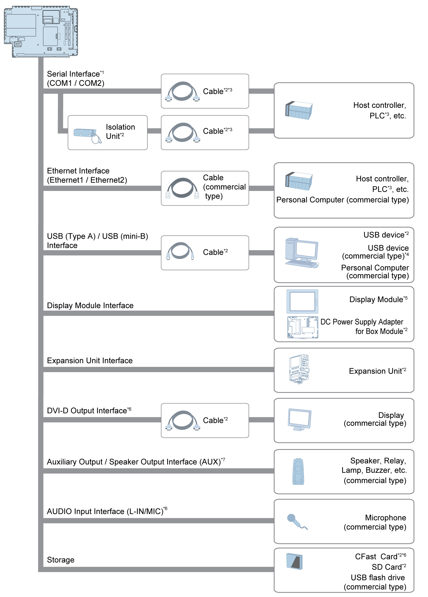

# Box Module

Box Module

\*1 In order to use this as an isolation port, Isolation Unit is required. To use RS-232C isolation unit, set the #9 pin of the COM port to VCC (on Standard Box connect the isolation unit to COM1, and on other Box Modules connect to COM2).

\*2 Refer to [Accessories](Chapter2-3.htm#XREF_D_SE_0029654_1).

\*3 For information on how to connect controllers and other types of equipment, refer to the corresponding device driver manual of your screen editing software.

\*4 For supported models, contact your local Schneider Electric support representative.

\*5 Refer to the [Part Numbers](../Chapter1/Chapter1-3.htm#XREF_D_SE_0030834_1).

\*6 Only for Open Box.

\*7 Only for Premium Box and Open Box.

NOTE: When working with the Open Box, refer to both this manual and Help Guide included on the provided restore DVD.