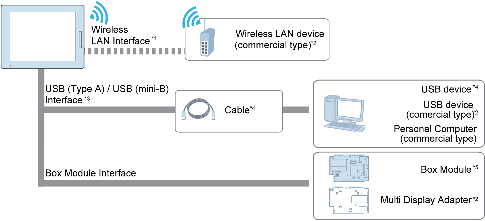

# Display Module

Display Module

\*1 Only for Wireless LAN model .

\*2 For supported models, contact your local Schneider Electric support representative.

\*3 Only for Smart Display. Refer to the Part Numbers.

\*4 Refer to Accessories.

\*5 Refer to the Part Numbers.

NOTE: When using wireless LAN models with the Open Box, for the wireless LAN settings, refer to the Harmony GTU Open Box Wireless LAN Setting Manual. When using wireless LAN models with the Premium Box, refer to your screen editing software manual.