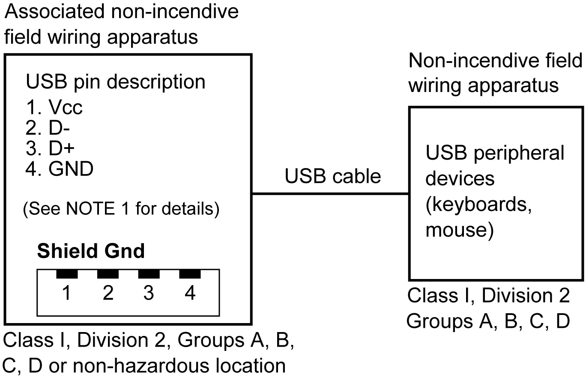
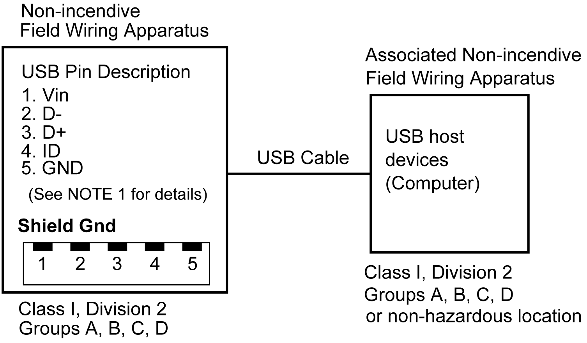

# Interface Connection

Interface Connection

Introduction

Use only the SELV (Safety Extra-Low Voltage) circuit to connect the serial, USB and Ethernet interfaces.

Cable Connections

|  |
| --- |
| Danger_Color.gifDANGER |
| POTENTIAL FOR EXPLOSION |
| oAlways confirm the ANSI/ISA 12.12.01 or CSA C22.2 N°213 hazardous location rating of your device before installing or using it in a hazardous location.  oTo apply or remove the supply power from this product installed in a Class I, Division 2 hazardous location, you must either:  oUse a switch located outside the hazardous environment, or;  oUse a switch certified for Class I, Division 1 operation inside the hazardous area.  oDo not connect or disconnect equipment unless power has been switched off or the area is known to be non-hazardous. This applies to all connections including power, ground, serial, parallel, and network connections.  oNever use unshielded / ungrounded cables in hazardous locations.  oUse only non-incendive USB devices.  oUse the USB (mini-B) interface for temporary connection only during maintenance and setup of the device.  oDo not use the USB (mini-B) interface in hazardous locations.  oWhen enclosed, keep enclosure doors and openings closed at all times to avoid the accumulation of foreign matter inside the workstation. |
| Failure to follow these instructions will result in death or serious injury. |

Division 2 hazardous location regulations require that all cable connections be provided with adequate strain relief and positive interlock. Use only non-incendive USB devices as USB connections do not provide adequate strain relief to allow the use of the USB connections of this product . Never connect or disconnect a cable while power is applied at either end of the cable. All communication cables should include a chassis ground shield. This shield should include both copper braid and aluminum foil. The D-sub style connector housing must be a metal conductive type (for example, molded zinc) and the ground shield braid must be terminated directly to the connector housing. Do not use a shield drain wire.

The outer diameter of the cable must be suited to the inner diameter of the cable connector strain relief so that a reliable degree of strain relief is maintained. Always secure the D-sub connectors to the workstation-mating connectors via the two screws located on both sides.

USB Connection

Non-incendive field wiring apparatus (keyboards, mouse) are permitted for use on the front USB port (Type A) of associated field wiring non-incendive apparatus (this product). Non-incendive field wiring apparatus (this product) are permitted for use on front USB port (mini B) of associated field wiring non-incendive apparatus (Computer).

In addition to being non-incendive, any equipment connected to the front USB ports must satisfy the following criteria.

The following figure shows the USB cable wiring:

<Type A>

| Circuit Parameters | Front USB (Type A) |
| --- | --- |
| Open-circuit voltage = Voc | 5.25 Vdc |
| Short-circuit current = Isc | 1,300 mA |
| Associated capacitance = Ca | 265 μF |
| Associated inductance = La | 16 μH |

<mini B>

| Circuit Parameters | Front USB (mini B) |
| --- | --- |
| Maximum input voltage = Vmax | 5.25 Vdc |
| Maximum load current = Imax | 0.1 mA |
| Internal capacitance = Ci | 0.24 μF |
| Internal inductance = Li | 16 μH |

NOTE:

1. The above tables list the non-incendive circuit parameters.

The Entity Concept allows interconnection of non-incendive apparatus with associated apparatus – not specifically examined combinations – as a system when the approved values of Voc (or Uo) and Isc (or Io) for the associated apparatus are less than or equal to Vmax (Ui) and Imax (Ii) for the non-incendive apparatus, and the approved values of Ca (Co) and La (Lo) for the associated apparatus are greater than or equal to Ci + Ccable and Li + Lcable, respectively, for the non-incendive field wiring apparatus.

2. Associated non-incendive field wiring apparatus and non-incendive field wiring apparatus shall satisfy the following:

| Associated Non-incendive Field Wiring Apparatus | - | Non-incendive Field Wiring Apparatus |
| --- | --- | --- |
| Voc | ≤ | Vmax |
| Isc | ≤ | Imax |
| Ca | ≥ | Ci + Ccable |
| La | ≥ | Li + Lcable |

3. If the electrical parameters of the cable are unknown, the following values may be used:

Ccable = 196.85 pF/m (60 pF/ft)

Lcable = 0.656 μH/m (0.20 μH/ft)

4. Wiring methods must be in accordance with the electrical code of the country where it is used.

This product must be installed in an enclosure. If installed in a Class I, Division 2 Location, the enclosure must be capable of accepting one or more Division 2 wiring methods.

|  |
| --- |
| Danger_Color.gifDANGER |
| POTENTIAL FOR EXPLOSION |
| oVerify the power, input, and output (I/O) wiring are in accordance with Class I, Division 2 wiring methods.  oSubstitution of any components may impair suitability for Class I, Division 2.  oDo not disconnect equipment while the circuit is live or unless the area is known to be free of ignitable concentrations.  oRemove power before attaching or detaching any connectors to or from this product.  oEnsure that power, communication, and accessory connections do not place excessive stress on the ports. Consider the vibration in the environment when making this determination.  oSecurely attach power, communication, and external accessory cables to the panel or cabinet.  oUse only commercially available USB cables.  oUse only non-incendive USB configurations.  oSuitable for use in Class I, Division 2, Groups A, B, C, D Hazardous Locations.  oConfirm that the USB cable has been attached with the USB cable clamp before using the USB interface. |
| Failure to follow these instructions will result in death or serious injury. |

EIO0000001735\_05

© 2017 Schneider Electric. All rights reserved.