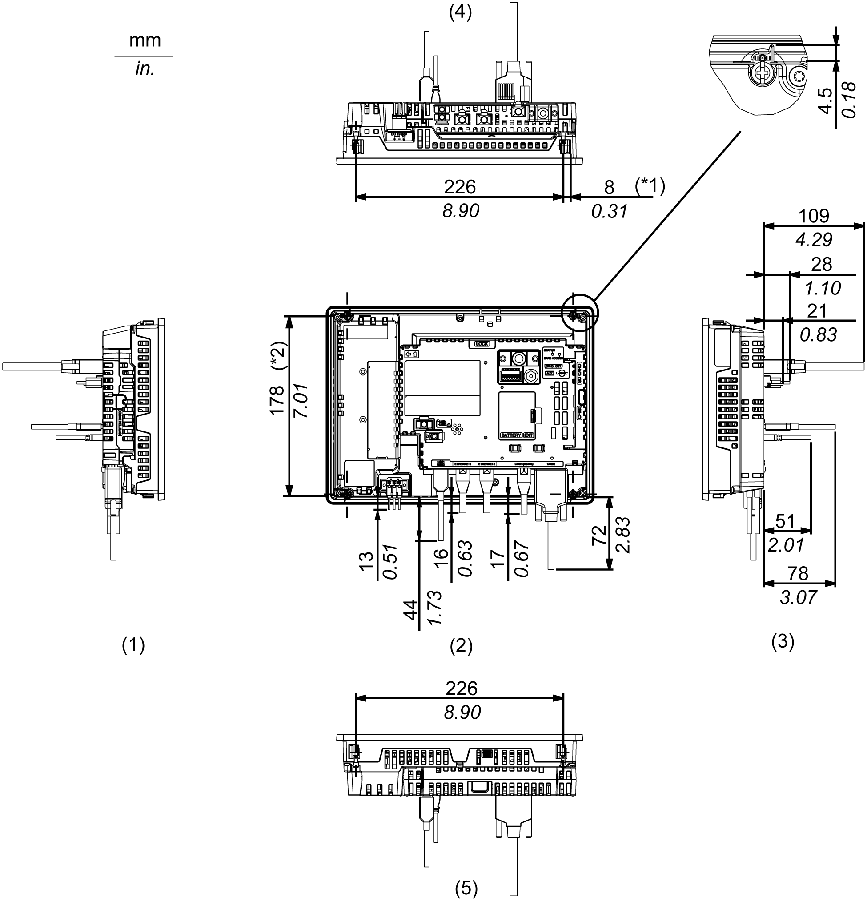

# Dimensions with Cables

Dimensions with Cables

\*1   Rotation area of the fastener

\*2   Pitch of the center of installation fastener screws

    

1   Right

2   Front

3   Left

4   Bottom

5   Top

NOTE: All the above values are designed with cable bending in mind. The dimensions given here are representative values depending on the type of connection cable in use. Therefore, these values are intended for reference only.