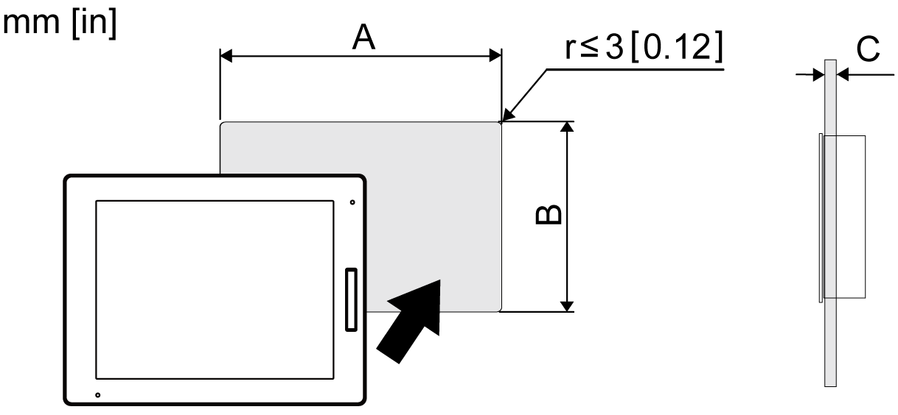

# Panel Cut Dimensions

Panel Cut Dimensions

Based on the panel cut dimensions, open a mount hole on the panel.

| Model Name | A | B | C |
| --- | --- | --- | --- |
| HMIDT542 | 259 mm (+1/-0 mm)  (10.2 in [+0.04/-0 in]) | 201 mm (+1/-0 mm)  (7.91 in [+0.04/-0 in]) | 1.6...5 mm  (0.06...0.2 in) |
| HMIDT642  HMIDT643 | 301.5 mm (+1/-0 mm)  (11.87 in [+0.04/-0 in]) | 227.5 mm (+1/-0 mm)  (8.96 in [+0.04/-0 in]) |
| HMIDT732 | 383.5 mm (+1/-0 mm)  (15.1 in [+0.04/-0 in]) | 282.5 mm (+1/-0 mm)  (11.12 in [+0.04/-0 in]) |
| HMIDT752 | 396 mm (+1/-0 mm)  (15.59 in [+0.04/-0 in]) | 277 mm (+1/-0 mm)  (10.91 in [+0.04/-0 in]) |
| HMIDT952 | 465 mm (+1/-0 mm)  (18.31 in [+0.04/-0 in]) | 319 mm (+1/-0 mm)  (12.56 in [+0.04/-0 in]) |
| HMIDT351 | 190 mm (+1/-0 mm)  (7.48 in [+0.04/-0 in]) | 135 mm (+1/-0 mm)  (5.31 in [+0.04/-0 in]) |
| HMIDT551 | 255 mm (+1/-0 mm)  (10.04 in [+0.04/-0 in]) | 185 mm (+1/-0 mm)  (7.28 in [+0.04/-0 in]) |
| HMIDT651 | 295 mm (+1/-0 mm)  (11.61 in [+0.04/-0 in]) | 217 mm (+1/-0 mm)  (8.54 in [+0.04/-0 in]) |