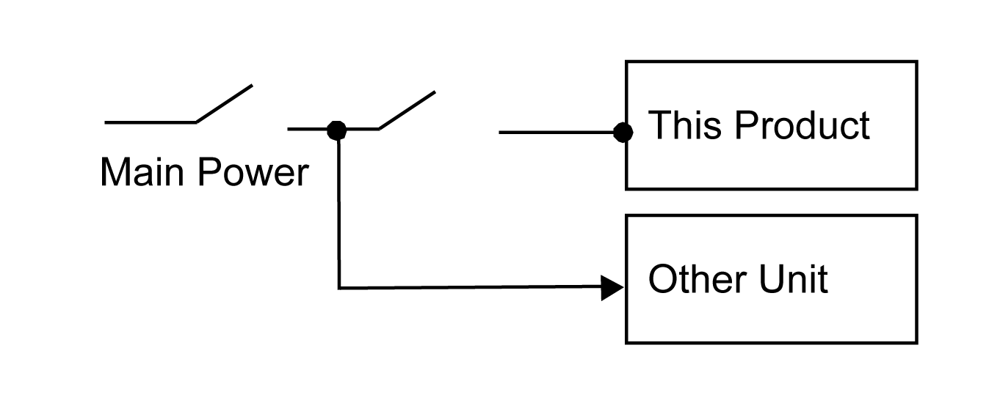
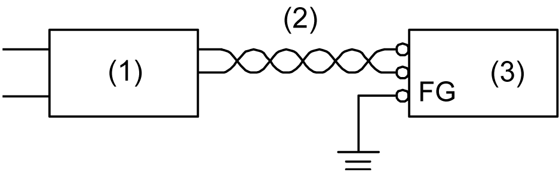

# Power Supply Connections

Power Supply Connections

oWhen supplying power to this product, connect the power as shown below.

o Use a Class 2 power supply or SELV (Safety Extra-Low Voltage) circuit and LIM (Limited Energy) circuit for DC input.

oThe following shows a surge protection device connection:

oAttach a surge protection device to prevent damage to this product as a result of a lightning-induced power surge from a large electromagnetic field generated from a direct lightning strike. We also strongly recommend to connect the crossover grounding wire of this product to a position close to the ground terminal of the surge protection device.

It is expected that there will be an effect on this product due to fluctuations in grounding potential when there is a large surge flow of electrical energy to the lightning rod ground at the time of a lightning strike. Provide adequate distance between the lightning rod grounding point and the surge protection device grounding point.

oIf the voltage variation is outside the prescribed range, connect a regulated power supply.

1   Regulated power supply

2   Twisted-pair cord

3   This product