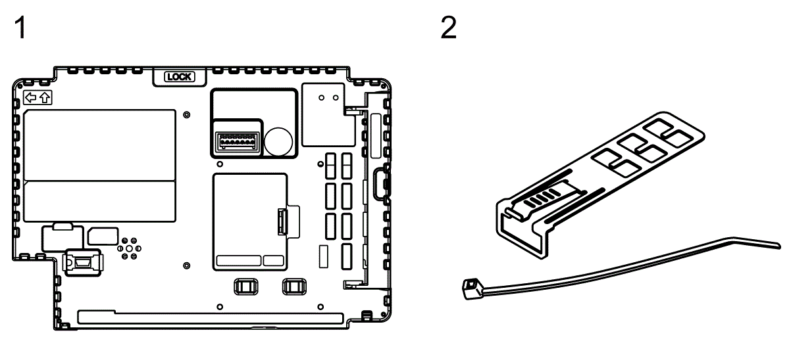
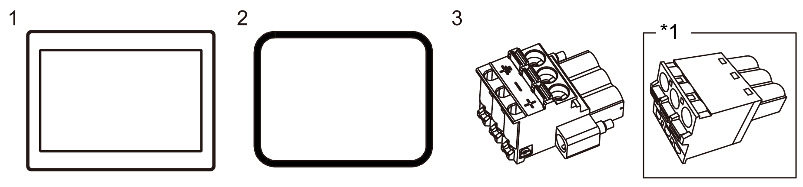
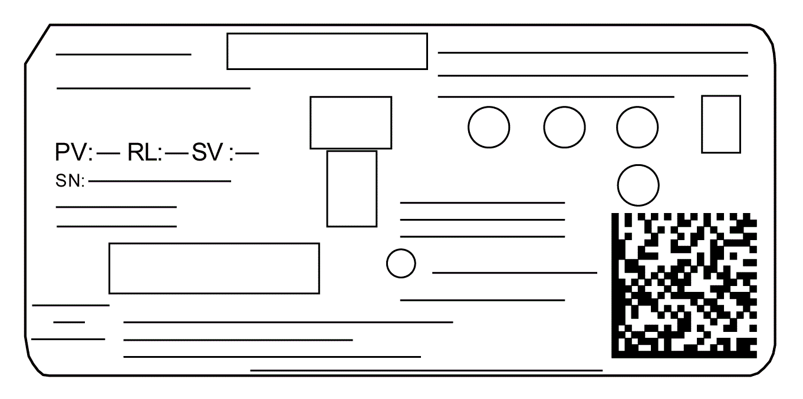
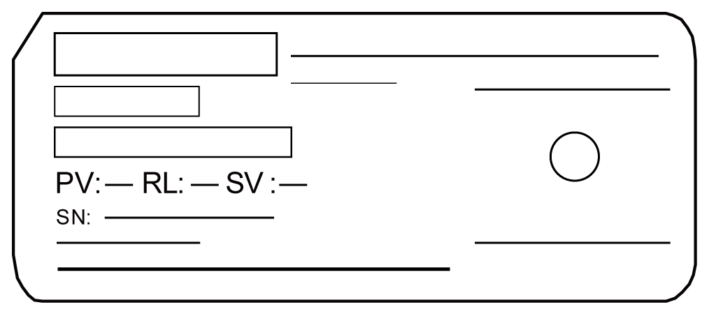

# Package Contents

Package Contents

NOTE: This product has been carefully packed with special attention to quality. However, should you find anything damaged or missing, please contact your local distributor immediately.

Box Module

Verify all items listed here are present in your package:

1 Harmony GTUX eXtreme Box: 1

2 USB Clamp Type A (1 port): 2 sets (1 set = 1 clip and 1 tie)

3 Quick Reference Guide: 1

Display Module

Verify all items listed here are present in your package:

1 Harmony GTUX eXtreme Display: 1

2 Installation Gasket: 1 (attached to this product)

3 DC Power Supply Connector (Right-angle\*1): 1

4 Quick Reference Guide: 1

\*1 Straight type for HMIDT35X.

Revision

You can identify the product version (PV), revision level (RL), and the software version (SV) from the product label.

EIO0000003565\_03

© 2019 Schneider Electric. All rights reserved.