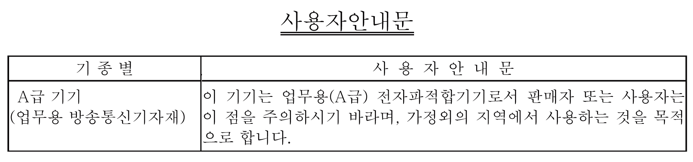

# Certifications and Standards

Certifications and Standards

Some products are not subject to certification and standards. And some products have not received their certification and standards but are scheduled for assessment.

The certifications and standards listed below may include those that are not yet acquired for this product. For the latest certifications and standards that this product has acquired, please check the product marking or the following URL.

[www.schneider-electric.com](http://www.schneider-electric.com)

Agency Certifications

oUnderwriters Laboratories Inc., UL 61010-2-201 and CSA C22.2 No61010-2-201, Industrial Control Equipment

oUnderwriters Laboratories Inc., UL 121201 and CSA C22.2 No213, Electrical Equipment for Use in Class I, Division 2 Hazardous (Classified) Locations

oIECEx / ATEX for use in zones 2/22

oEAC certification (Russia, Belarus, Kazakhstan)

Compliance Standards

Europe:

CE

oDirective 2014/30/EU (EMC)

oProgrammable Controllers: EN 61131-2

oEN61000-6-4

oEN61000-6-2

oDirective 2014/34/EU (ATEX)

oEN60079-0

oEN60079-15

oEN60079-31

Australia

oRCM

oAS/NZS CISPR11 (EN55011)

Korea

oKC

oKN11

oKN61000-6-2

Qualifications Standards

Schneider Electric voluntarily tested this product to additional standards. The additional tests performed, and the standards under which the tests were conducted, are specifically identified in [Structural Specifications](../Chapter4/Chapter4-5.htm#XREF_D_SE_0090038_1).

Hazardous Substances

This product is designed to be compliant with the following environmental regulations, even if the product may not fall directly in the scope of the regulation:

oWEEE, Directive 2012/19/EU

oRoHS, Directive 2011/65/EU and 2015/863/EU

oRoHS China, Standard GB/T 26572

oREACH regulation EC 1907/2006

End of Life (WEEE)

The product contains electronic boards. It must be disposed of in specific treatment channels. The product contains cells and/or storage batteries which must be collected and processed separately when they have run out and at the end of product life (Directive 2012/19/EU).

Refer to [Maintenance](../Chapter7/Chapter7-1.htm#XREF_D_SE_0030415_1) when extracting cells and batteries from the product. These batteries do not contain a weight percentage of heavy metals over the threshold notified by European Directive 2006/66/EC.

European (CE) Compliance

The product described in this manual comply with the European Directives concerning Electromagnetic Compatibility and Low Voltage (CE marking) when used as specified in the relevant documentation, in application for which they are specifically intended, and in connection with approved third-party products.

KC Markings

EIO0000003565\_03

© 2019 Schneider Electric. All rights reserved.