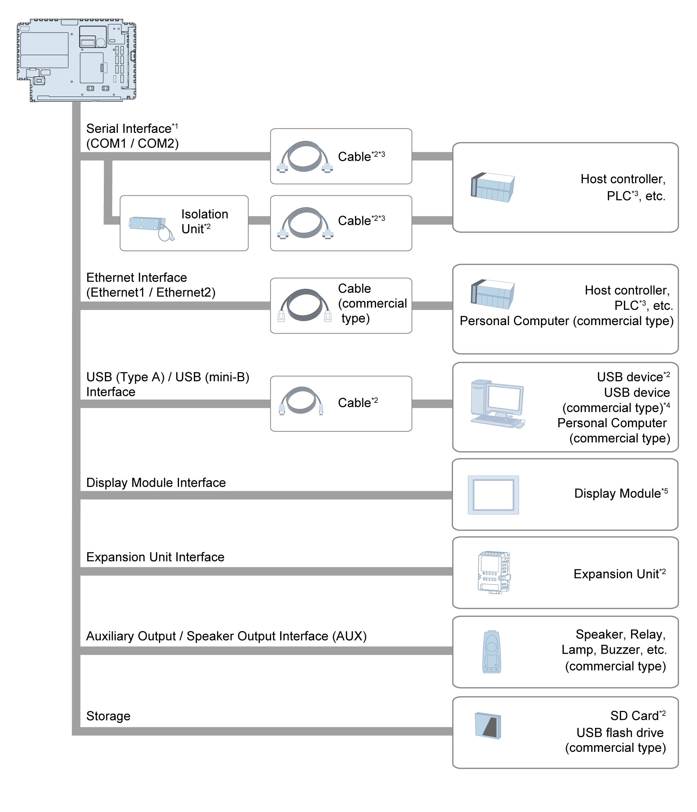

# Box Module

Box Module

\*1 In order to use this as an isolation port, Isolation Unit is required. To use RS-232C isolation unit, set the #9 pin of the COM port to VCC. (Only for COM2)

\*2 Refer to [Accessories](Chapter2-3.htm#XREF_D_SE_0090029_1).

\*3 For information on how to connect controllers and other types of equipment, refer to the corresponding device driver manual of your screen editing software.

\*4 For supported models, contact your local Schneider Electric support representative.

\*5 Connects only to eXtreme Display. Refer to the [Part Numbers](../Chapter1/Chapter1-2.htm#XREF_D_SE_0090002_1).