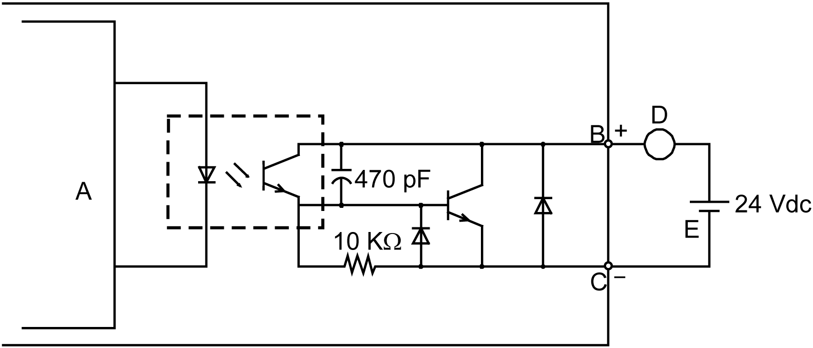

# Auxiliary Output/Speaker Output Interface (AUX)

Auxiliary Output/Speaker Output Interface (AUX)

|  |
| --- |
| DangerElectrical_Color.gifDanger_Color.gifDANGER |
| ELECTRIC SHOCK AND FIRE |
| When using the SG terminal to connect an external device to this product:  oVerify that a ground loop is not created when you set up the system.  oConnect the SG terminal to remote equipment when the external device is not isolated.  oConnect the SG terminal to a known reliable ground connection to reduce the risk of damaging the circuit. |
| Failure to follow these instructions will result in death or serious injury. |

| Cable connection side | Pin No. | Signal name | Direction | Meaning |
| --- | --- | --- | --- | --- |
| G-SE-0027239.1.gif-high.gif | 1 | LineOut | Output | Line Out |
| 2 | LineOut\_GND | Output | Line Out Ground |
| 3 | SP+ | Output | Speaker + |
| 4 | SP- | Output | Speaker - |
| 5 | NC | – | No Connection |
| 6 | ALARM+/ BUZZER+ | Output | (Can be changed via software) |
| 7 | ALARM-/ BUZZER- | Output |

AUX Connector: HMIZGAUX by Schneider Electric

Output Circuit

A Internal Circuit

B Pin Number 6: ALARM+/BUZZER+

C Pin Number 7: ALARM-/BUZZER-

D Load

E External Power

EIO0000003565\_03

© 2019 Schneider Electric. All rights reserved.