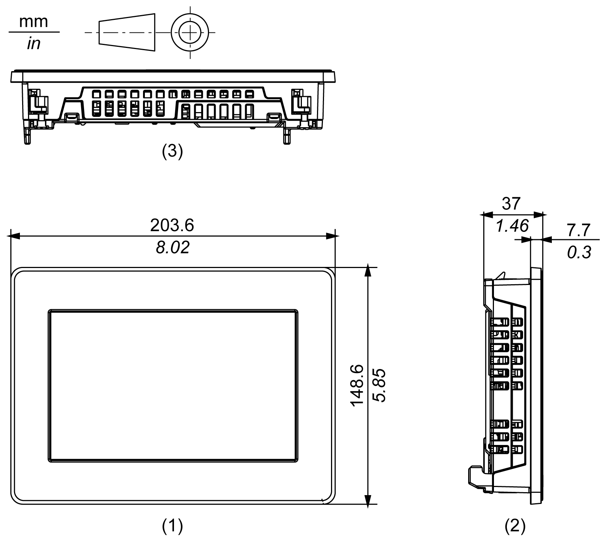
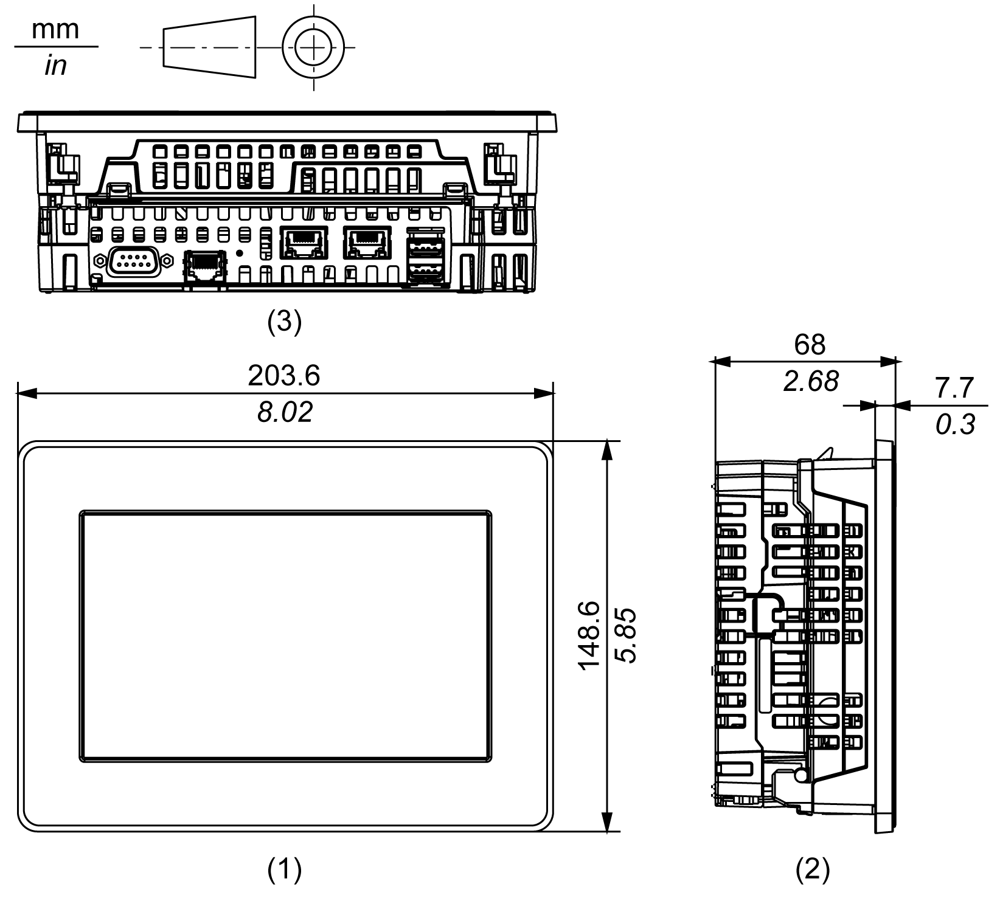
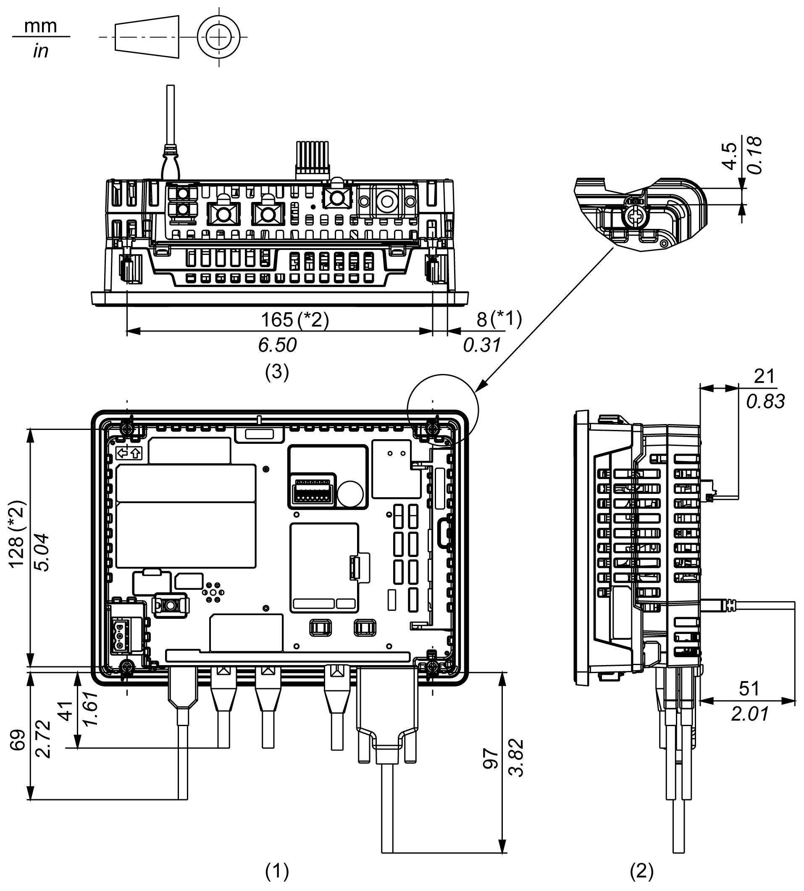

# HMIDT35X

HMIDT35X

External Dimensions

1 Front

2 Left

3 Bottom

Dimensions with Box Module

1 Front

2 Left

3 Bottom

Dimensions with Cables

\*1 Rotation area of the fastener

\*2 Pitch of the enter of installation fastener screws

1 Rear

2 Right

3 Bottom

NOTE: All the above values are designed with cable bending in mind. The dimensions given here are representative values depending on the type of connection cable in use. Therefore, these values are intended for reference only.

EIO0000003565\_03

© 2019 Schneider Electric. All rights reserved.