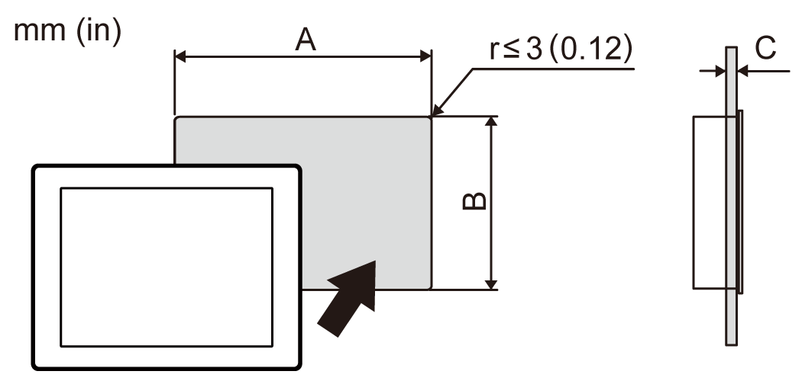

# Panel Cut Dimensions

Panel Cut Dimensions

Based on the panel cut dimensions, open a mount hole on the panel.

| Model Name | | |
| --- | --- | --- |
| A | B | C |
| HMIDT35X | | |
| 190 mm (+1/-0 mm)  (7.48 in [+0.04/-0 in]) | 135 mm (+1/-0 mm)  (5.31 in [+0.04/-0 in]) | 1.6...5 mm (0.06...0.2 in) |
| HMIDT65X | | |
| 295 mm (+1/-0 mm)  (11.61 in [+0.04/-0 in]) | 217 mm (+1/-0 mm)  (8.54 in [+0.04/-0 in]) | 1.6...5 mm (0.06...0.2 in) |
| HMIDT75X | | |
| 394 mm (+1/-0 mm)  (15.51 in [+0.04/-0 in]) | 250 mm (+1/-0 mm)  (9.84 in [+0.04/-0 in]) | 1.6...5 mm (0.06...0.2 in) |

EIO0000003565\_03

© 2019 Schneider Electric. All rights reserved.