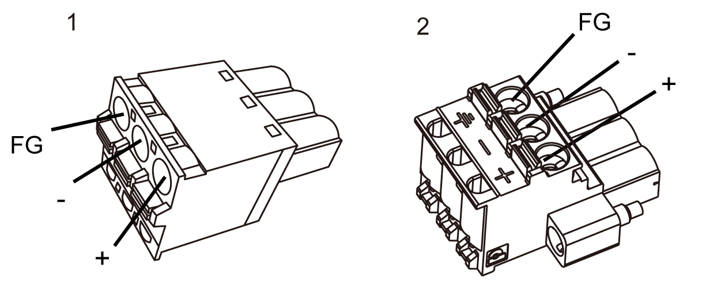

# DC Power Supply Connector Specifications: Spring Clamp Terminal Blocks

DC Power Supply Connector Specifications: Spring Clamp Terminal Blocks

Models except for HMIDT35X come with the right-angle-type power connector, and the HMIDT35X comes with the straight-type power connector.

1 Straight type: HMIZGPWS by Schneider Electric

2 Right-angle type: HMIZGPWS2 by Schneider Electric

NOTE: You cannot connect the right-angle type to the HMIDT35X.

| Connection | Wire |
| --- | --- |
| + | 12...24 Vdc |
| - | 0 Vdc |
| FG | Grounded terminal connected to the panel chassis. |