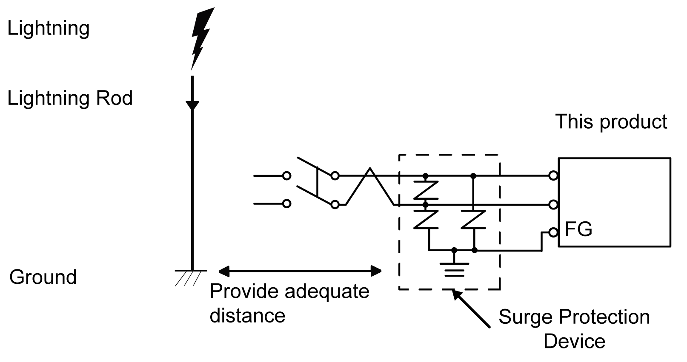

# Connecting the Power Supply

Connecting the Power Supply

Precautions

|  |
| --- |
| DangerElectrical_Color.gifDanger_Color.gifDANGER |
| SHORT CIRCUIT, FIRE, OR UNINTENDED EQUIPMENT OPERATION |
| Avoid excessive force on the power cable to prevent accidental disconnection  oSecurely attach power cables to an installation panel or cabinet.  oInstall and fasten this product on installation panel or cabinet prior to connecting power supply and communication lines. |
| Failure to follow these instructions will result in death or serious injury. |

Improving Noise/Surge Resistance

oThis product’s power supply cord should not be bundled with or kept close to main circuit lines (high voltage, high current), power lines, or input/output lines, and their various systems should be kept separate. When power lines cannot be wired via a separate system, use shielded cables for input/output lines.

oMake the power cord as short as possible, and be sure to twist the ends of the wires together (i.e. twisted pair cabling) from close to the power supply unit.

oIf there is an excess amount of noise on the power supply line, reduce the noise with a noise filter before turning on the power.

oConnect a surge protection device to handle power surges.

oTo increase noise resistance, attach a ferrite core to the power cable.

Power Supply Connections

oWhen supplying power to this product, connect the power as shown below.

o Use SELV (Safety Extra-Low Voltage) circuit and LIM (Limited Energy) circuit for DC input.

oThe following shows a surge protection device connection:

oAttach a surge protection device to prevent damage to this product as a result of a lightning-induced power surge from a large electromagnetic field generated from a direct lightning strike. We also strongly recommend to connect the crossover grounding wire of this product to a position close to the ground terminal of the surge protection device.

It is expected that there will be an effect on this product due to fluctuations in grounding potential when there is a large surge flow of electrical energy to the lightning rod ground at the time of a lightning strike. Provide adequate distance between the lightning rod grounding point and the surge protection device grounding point.

oIf the voltage variation is outside the prescribed range, connect a regulated power supply.

1 Regulated power supply

2 Twisted-pair cord

3 This product

EIO0000003565\_03

© 2019 Schneider Electric. All rights reserved.