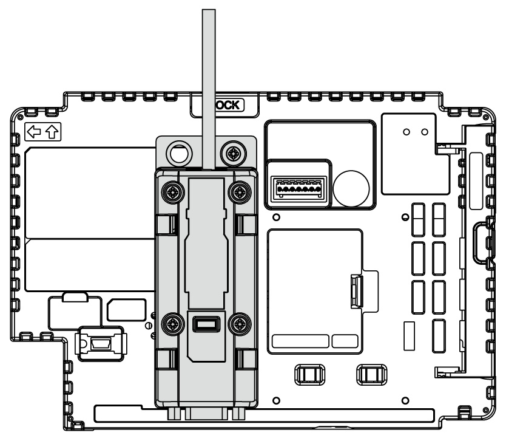

# Installing to the Box Module

Installing to the Box Module

You can install the Isolation Unit to the back of the Box Module or to the installation panel. For more information on how to attach the Isolation Unit to the installation panel, please refer to the Isolation Unit Quick Reference Guide.

NOTE: When the fixing bracket is attached, you cannot attach the isolation unit.

| Step | Action |
| --- | --- |
| 1 | Check the locations of two screw holes on the front of the Box Module.  G-SE-0070132.1.gif-high.gif  1   Screw hole |
| 2 | Install one of the two attachment screws included in the Isolation Unit to the Box Module. Use a torque of 0.5 N•m (4.4 lb-in).  G-SE-0025373.2.gif-high.gif  1   Attachment screw  A   Box Module |
| 3 | Attach the Isolation Unit to the Box Module.  G-SE-0025374.2.gif-high.gif  2   Isolation Unit  A   Box Module |
| 4 | Slide the Isolation Unit in the direction of the arrow so the Isolation Unit is hooked by the screw from Step 2.  G-SE-0025375.2.gif-high.gif  A   Box Module |
| 5 | Secure the Isolation Unit in place with another attachment screw. Use a torque of 0.5 N•m (4.4 lb-in).  G-SE-0025376.2.gif-high.gif  A   Box Module |

NOTE:

oAttach the Isolation Unit to a stable surface. Do not leave the Isolation Unit hanging by its cord.

oBe careful with wire placement. Overlapping cords may cause noise.

oWhen attaching the Isolation Unit to the Box Module, be careful with the attachment position.

oSee the illustration below for recommended installation.

EIO0000003565\_03

© 2019 Schneider Electric. All rights reserved.