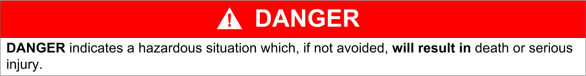
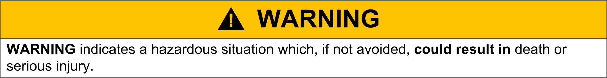

# NOTICE

NOTICE

Read these instructions carefully, and look at the equipment to become familiar with the device before trying to install, operate, or maintain it. The following special messages may appear throughout this documentation or on the equipment to warn of potential hazards or to call attention to information that clarifies or simplifies a procedure.

