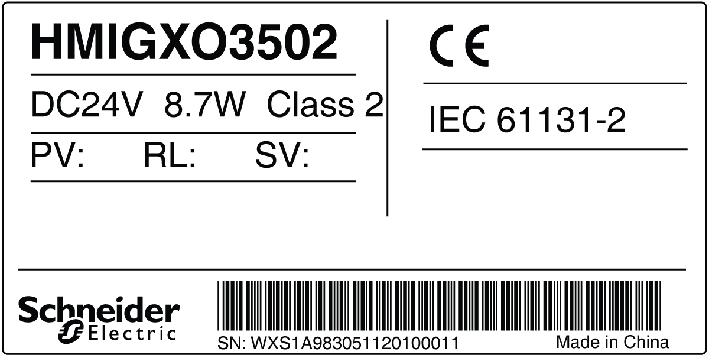

# Revision

Revision

You can identify the product version (PV), revision level (RL), and the software version (SV) from the product label on the panel.

The following diagram is a representation of a typical label:

