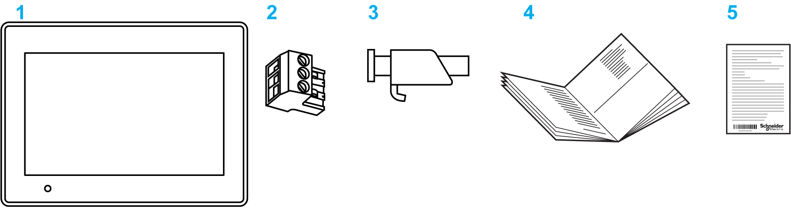

# Package Contents

Package Contents

Overview

Make sure all applicable items listed here are included in the panel package:

1   Panel

2   DC power connector

3   Screw installation fasteners (HMIGXO3501 and HMIGXO3502 x 4, HMIGXO5502 x 6)

4   HMIGXO Installation guide

5   HMIGXO Flyer

Revision

You can identify the product version (PV), revision level (RL), and the software version (SV) from the product label on the panel.

The following diagram is a representation of a typical label:

EIO0000000963.03

© 2016 Schneider Electric. All rights reserved.