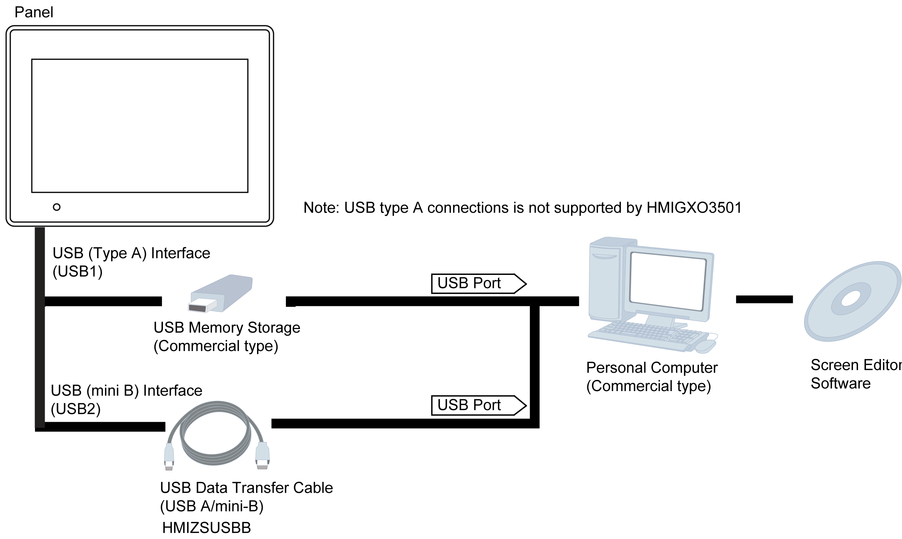

# System Design

System Design

Introduction

The following diagrams represent the main selection of equipments you can connect to the panels.

Edit Mode Peripherals

Run Mode Peripherals - USB Type A/mini B Interface

Run Mode Peripherals - Serial Communication

EIO0000000963.03

© 2016 Schneider Electric. All rights reserved.