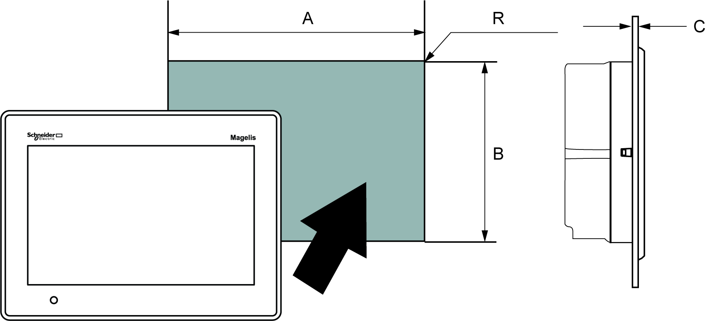

# Panel-cut Dimensions

Panel-cut Dimensions

Inserting a HMIGXO

Create a panel-cut and insert the panel from the front. The following illustration shows the panel-cut for the HMIGXO series:

Dimensions

The following table shows the panel-cut dimensions for each panel:

| Model | A | B | C (Panel Thickness) | R |
| --- | --- | --- | --- | --- |
| HMIGXO350• | 190±1 mm (7.48±0.04 in) | 135±0.7 mm (5.31±0.03 in) | 1.5...10 mm  (0.06...0.39 in) | 3 mm  (0.12 in) max. |
| HMIGXO5502 | 255±1.8 mm (10.04±0.07 in) | 185+1 mm (7.28+0.04 in) | 1.5...10 mm  (0.06...0.39 in) | 3 mm  (0.12 in) max. |

EIO0000000963.03

© 2016 Schneider Electric. All rights reserved.