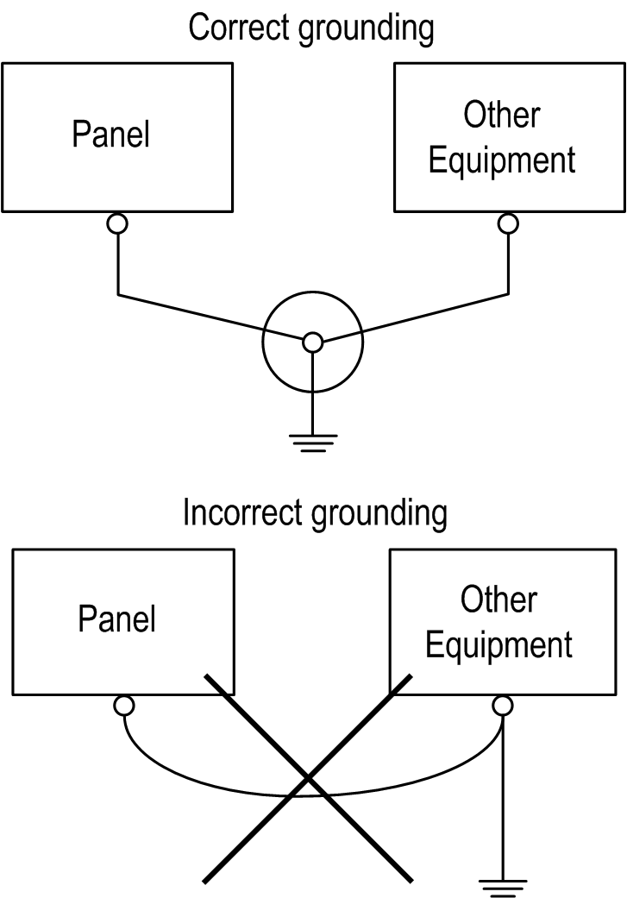

# Common Grounding

Common Grounding

Take the following precautions for grounding the panel.

Electromagnetic Interference (EMI) can be created if the devices are improperly grounded. EMI can cause loss of communication.

Do not use common grounding, except for the authorized configuration described below.

If exclusive grounding is not possible, use a common connection point.

