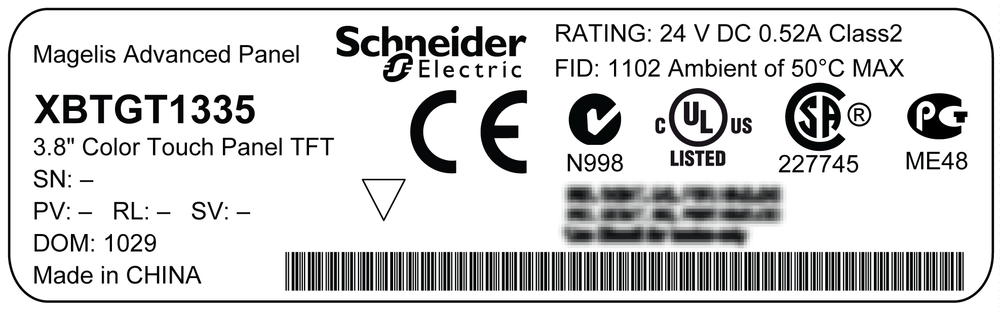

# Revision

Revision

You can identify the product version (PV), revision level (RL), and the software version (SV) from the product label sticker pasted on the unit.

The following diagram show a typical representation of label sticker:

