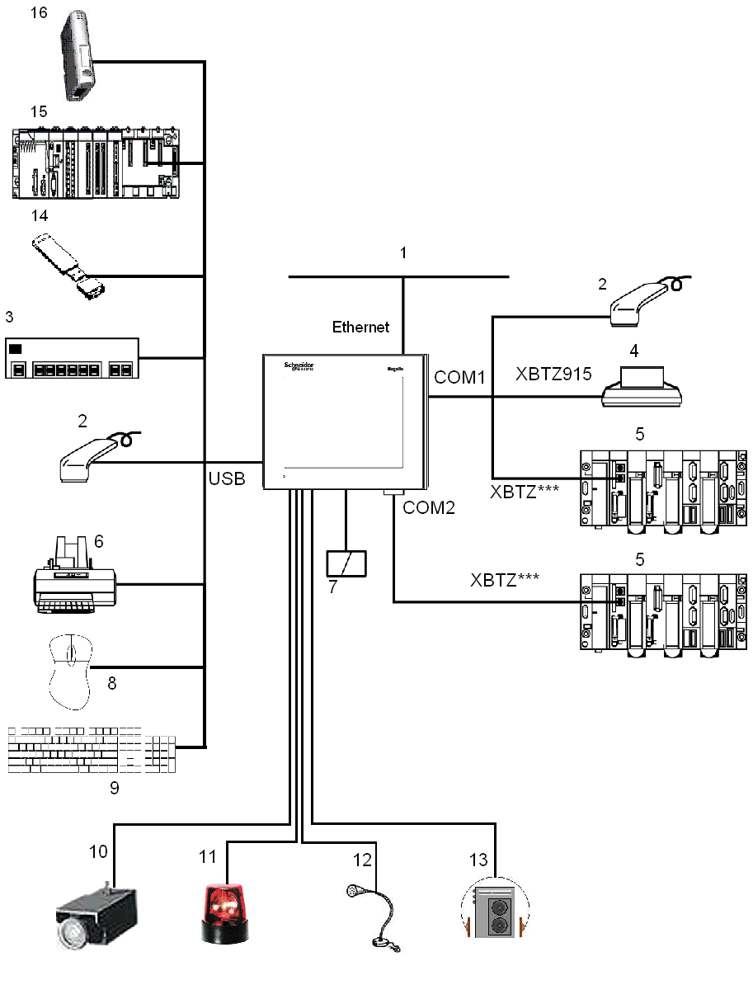

# XBT GT1005/2000/4000/5000/6000/7000 and XBT GK2000/5000 Series Run Mode Peripherals

XBT GT1005/2000/4000/5000/6000/7000 and XBT GK2000/5000 Series Run Mode Peripherals

1   Ethernet network connection (not available on XBT GH, XBT GT1105/2110/2120/2220 and XBT GK2120)

2   Serial bar code reader (validated with Gryphon range of Datalogic)

3   USB hub (commercial type)

4   Serial printer

5   PLC

6   Parallel printer (printer function validated with EPSON and HP models; details available on Vijeo Designer documentation)

7   Compact Flash (CF) Card (not available on XBT GT1105/1135/1335/2110)

8   USB Mouse

9   USB Keyboard

10   Camera (available on XBT GTxx40 products only and Vijeo Designer Version higher than V4.3)

11   Flashing light (not available on XBT GT1005/2000 series and XBT GK2000 series)

12   Microphone (available on XBT GTxx40 products only and Vijeo Designer Version higher than V4.3)

13   Speaker (not available on XBT GT1005/2000 series and XBT GK2000 series)

14   USB Memory Stick

15   PLC with USB Terminal port (Modicon M340)

16   Communication Gateway (ModbusPlus or Fipio)