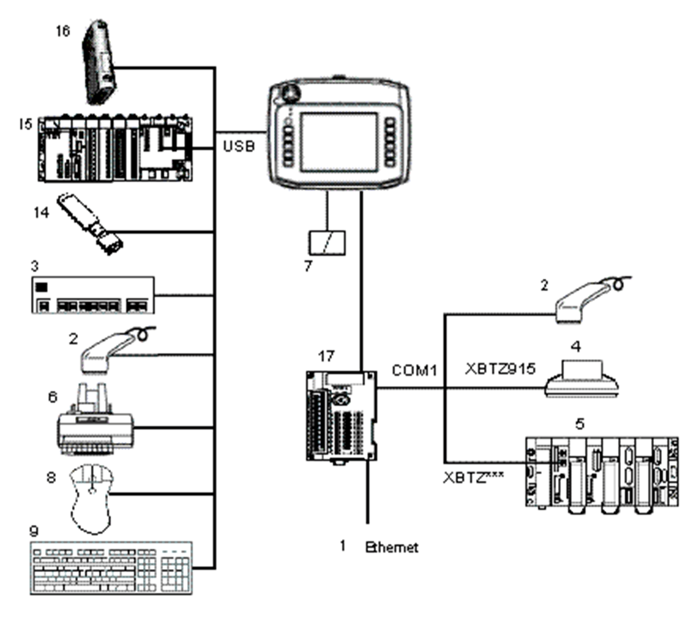

# XBT GH Series Run Mode Peripherals

XBT GH Series Run Mode Peripherals

1   Ethernet network connection (not available on XBT GH XBT GT1105/2110/2120/2220 and XBT GK2120)

2   Serial bar code reader (validated with Gryphon range of Datalogic)

3   USB hub (commercial type)

4   Serial printer

5   PLC

6   Parallel printer (printer function validated with EPSON and HP models; details available on Vijeo Designer documentation)

7   CF Card (not available on XBT GT1105/1135/1335/2110)

8   USB Mouse

9   USB Keyboard

14   USB Memory Stick)

15   PLC with USB Terminal port (Modicon M340)

16   Communication Gateway (ModbusPlus or Fipio)

17   Conversion Adaptor (XBT GH only, required for communications with PLC)