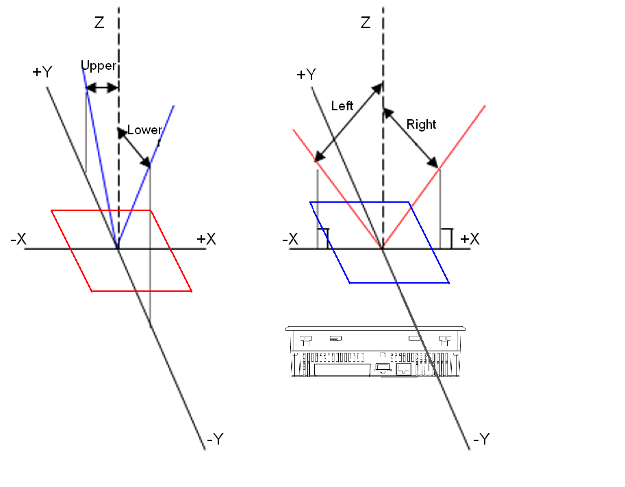

# Display Viewing Angle and Brightness

Display Viewing Angle and Brightness

| Model | Viewing angle | | | | | | | | | | Brightness | |
| --- | --- | --- | --- | --- | --- | --- | --- | --- | --- | --- | --- | --- |
| Schneider | Upper | | Lower | | Left | | Right | | Unit | Contrast (CR) | Actual Products | |
| Min | Typ | Min | Typ | Min | Typ | Min | Typ | Typ | Unit |
| XBT GT1105 | 20 | - | 30 | - | 40 | - | 40 | - | degrees | CR≥2 | 87/51 | cd/m2 |
| XBT GT1135 |
| XBT GT1335 |
| XBT GT2110 | 20 | - | 40 | - | 45 | - | 45 | - | degrees | CR≥2 | 216 | cd/m2 |
| XBT GT2120 |
| XBT GT2130 |
| XBT GT2220 | - | 65 | - | 70 | - | 55 | - | 55 | degrees | CR≥2 | 298 | cd/m2 |
| XBT GT2330 | 60 | 65 | 35 | 40 | 60 | 65 | 60 | 65 | degrees | CR≥5 | 422 | cd/m2 |
| XBT GT2430 | - | 80 | - | 70 | - | 80 | - | 80 | degrees | CR≥5 | 400 | cd/m2 |
| XBT GT2930 | - | 70 | - | 50 | - | 70 | - | 70 | degrees | CR≥5 | 1000 | cd/m2 |
| XBT GT4230 | - | 20 | - | 40 | - | 40 | - | 40 | degrees | CR≥2 | 167 | cd/m2 |
| XBT GT4330 | - | 50 | - | 70 | - | 70 | - | 70 | degrees | CR≥5 | 213 | cd/m2 |
| XBT GT4340 |
| XBT GT5230 | - | 20 | - | 35 | - | 45 | - | 45 | degrees | CR≥2 | 172 | cd/m2 |
| XBT GT5330 | 35 | 40 | 55 | 70 | 60 | 70 | 60 | 70 | degrees | CR≥10 | 311 | cd/m2 |
| XBT GT5340 |
| XBT GT5430 | 35 | 50 | 55 | 60 | 60 | 70 | 60 | 70 | 390 | cd/m2 |
| XBT GT6330 | 30 | 50 | 40 | 70 | 45 | 70 | 45 | 70 | degrees | CR≥10 | 170 | cd/m2 |
| XBT GT6340 |
| XBT GT7340 | 60 | 75 | 50 | 55 | 60 | 80 | 60 | 80 | degrees | CR≥2 | 220 | cd/m2 |
| XBT GK2120 | 20 | - | 40 | - | 45 | - | 45 | - | degrees | CR≥2 | 216 | cd/m2 |
| XBT GK2330 | 60 | 65 | 35 | 40 | 60 | 65 | 60 | 65 | degrees | CR≥5 | 422 | cd/m2 |
| XBT GK5330 | 35 | 40 | 55 | 70 | 60 | 70 | 60 | 70 | degrees | CR≥10 | 311 | cd/m2 |
| XBT GH2460 | - | 80 | - | 70 | - | 80 | - | 80 | degrees | CR≥5 | 189 | cd/m2 |

The definition of viewing angle:

